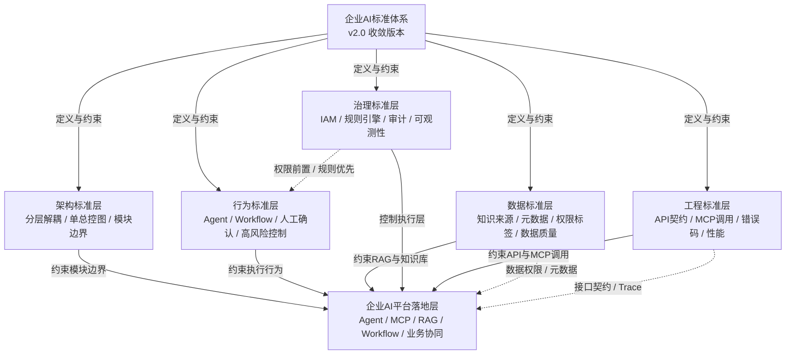

# 企业AI标准体系

版本：企业AI标准体系 v2.0 收敛版本  
更新时间：2026-06-29  
适用对象：企业软件工程师 / 架构师 / 技术负责人 / 数字化团队  

## 1. 本章核心结论

企业 AI 标准体系是本项目在 v2.0 收敛阶段形成的最高层规范，用于统一约束企业 AI 平台、Agent、MCP、RAG、Workflow、Multi-Agent、业务协同和业务 Agent 文档的设计表达。

本次收敛不新增业务功能、不扩展 Agent、不新增系统模块，只把现有 v1.0/v1.1/v1.2 内容固化为五类标准：架构标准、行为标准、数据标准、治理标准和工程标准。后续任何设计都应先对齐标准体系，再进入模块设计或工程实现。

## 2. 企业AI标准体系总览图

Mermaid 源文件：[企业AI标准体系总览图.mmd](../mermaid/00-项目管理/企业AI标准体系总览图.mmd)

## 3. 五大标准支柱

### 3.1 架构标准（Architecture Standard）

**定义：** 架构标准用于约束企业 AI 平台的总体分层、模块边界、总控图、部署边界和系统集成方式。

**作用：** 保证企业 AI 平台不是多个 AI Demo 的拼接，而是具有统一入口、统一 Agent Runtime、统一知识层、统一工具层、统一流程编排、统一治理和统一观测的体系化平台。

**解决的问题：**

1. 避免 Agent、RAG、MCP、Workflow 各自独立建设导致架构碎片化。
2. 避免多个“全局架构图”并存，导致汇报、评审和开发口径不一致。
3. 避免业务系统被 Agent 绕过，造成权限、审计和数据一致性风险。

**在当前项目中的体现：**

- `docs/09-企业AI平台/01-企业AI平台总体架构.md` 中的企业 AI 平台总控架构图。
- `00_项目管理/统一画图规范.md` 中“单总控图 + 分层图”的图体系。
- `docs/09-企业AI平台/03-组织与权限基础能力设计.md` 中组织、人员、菜单、权限作为统一底座。

### 3.2 行为标准（Agent & Workflow Standard）

**定义：** 行为标准用于约束 Agent、Workflow、Multi-Agent 和业务协同场景中的任务执行行为、流程边界、人工确认、高风险控制和失败处理。

**作用：** 保证 Agent 的行为可控、可解释、可追踪，不把确定性流程、审批条件、权限判断和高风险动作交给大模型自由决定。

**解决的问题：**

1. 避免 Agent 自行执行高风险写操作。
2. 避免 Multi-Agent 协作过程中职责不清、无限循环或越权调用。
3. 避免 Workflow 与 Agent 边界混乱，导致审批、确认和状态恢复不可控。

**在当前项目中的体现：**

- `docs/03-Agent/03-Agent工程架构.md` 中 Agent Runtime 执行链路和规则边界。
- `docs/06-Workflow/02-企业审批与业务流程编排.md` 中审批、人工确认和长任务编排。
- `docs/07-Multi-Agent/01-Multi-Agent协作模式.md` 中主控 Agent、专业 Agent 和规则校验 Agent 的协作方式。

### 3.3 数据标准（Data Standard）

**定义：** 数据标准用于约束知识来源、业务数据、元数据、权限标签、数据密级、数据质量、引用来源和数据流转方式。

**作用：** 保证 RAG、知识库、业务查询、订单、财务、结算和用户数据在进入 AI 链路前具备明确来源、权限、质量和审计信息。

**解决的问题：**

1. 避免知识库无来源、无版本、无权限标签。
2. 避免 RAG 检索把未授权内容交给大模型。
3. 避免业务 Agent 聚合多系统数据后丢失数据来源和审计依据。

**在当前项目中的体现：**

- `docs/05-RAG/02-企业知识库构建.md` 中企业知识库构建与 RAG 知识数据流图。
- `docs/18-订单Agent/01-订单Agent总体方案.md` 中订单 Agent 数据流图。
- `docs/19-结算Agent/01-结算Agent总体方案.md` 中结算金额计算链路图。
- `docs/20-业务协同Agent/01-用户订单结算财务协同方案.md` 中端到端业务对象与协同链路。

### 3.4 治理标准（Governance Standard）

**定义：** 治理标准用于约束 IAM、权限中心、规则引擎、审计日志、可观测性、成本控制、风险控制和合规留痕。

**作用：** 保证企业 AI 平台的每一次请求、检索、工具调用、流程编排、模型推理和业务系统访问都可控制、可审计、可观测。

**解决的问题：**

1. 避免权限判断后置到大模型输出阶段。
2. 避免业务规则写入提示词，导致不可审计、不可复核。
3. 避免问题发生后无法还原调用链路、规则命中、数据来源和模型输出。

**在当前项目中的体现：**

- `docs/09-企业AI平台/02-权限与安全设计.md` 中权限与安全设计。
- `docs/09-企业AI平台/04-平台运维与可观测性.md` 中 traceId、日志、指标和告警。
- `02_企业AI平台架构/Agent流程编排与规则引擎设计.md` 中规则引擎与性能设计约束。
- `00_项目管理/项目规则.md` 中权限前置、规则优先和审计留痕要求。

### 3.5 工程标准（Engineering Standard）

**定义：** 工程标准用于约束 API 契约、MCP 工具定义、错误码、幂等、超时、重试、缓存、降级、异步任务和交付方式。

**作用：** 保证企业 AI 平台不仅能写成方案，也能落到可开发、可联调、可测试、可运维的工程系统。

**解决的问题：**

1. 避免 MCP 工具描述不清、参数不稳定、错误不可解释。
2. 避免 Agent 多步骤调用缺少超时、重试、降级和幂等控制。
3. 避免示例接口、Mock 数据和业务文档之间口径不一致。

**在当前项目中的体现：**

- `docs/04-MCP/02-MCP服务设计.md` 中 MCP 工具注册与调用设计。
- `examples/springboot/mock-api-contracts.md` 和 `examples/springboot/sample-json/` 中 Mock API 契约与样例。
- `docs/15-AI开发实战/` 中 Spring Boot、Vue、Python RAG 的工程化入口。

## 4. 三条核心原则

### 4.1 分层解耦原则

企业 AI 平台必须按用户入口、AI 能力、治理控制、模型算力、数据知识、业务系统和可观测性进行分层。Agent、MCP、RAG、Workflow 可以协同，但不能互相替代。

### 4.2 权限前置原则（IAM + 规则引擎优先）

用户访问 Agent 前需要完成身份认证和权限校验；Agent 查询知识库、调用 MCP 工具、访问业务系统或触发 Workflow 时，需要进行二次权限判断。权限裁决、金额计算、审批条件和业务状态流转必须优先由 IAM、权限中心、规则引擎或业务系统处理。

### 4.3 可观测性原则（traceId + audit + metrics）

每一次 AI 任务都必须生成 traceId，串联用户请求、意图识别、权限校验、规则命中、RAG 检索、MCP 调用、Workflow 节点、模型推理、业务系统返回和最终输出。审计日志和指标监控必须支持问题追踪、风险复核、质量评估和成本分析。

## 5. 企业AI标准体系在本项目中的映射关系

| 项目体系 | 对应标准 | 映射说明 |
| --- | --- | --- |
| Agent体系 | 架构标准、行为标准、治理标准、工程标准 | Agent Runtime 必须对齐总控架构，执行行为受规则引擎、权限中心、审计和性能约束。 |
| MCP体系 | 架构标准、治理标准、工程标准 | MCP 工具必须通过注册、Schema、权限、规则、审计和错误契约进行治理。 |
| RAG体系 | 数据标准、治理标准、工程标准 | RAG 必须保证知识来源、元数据、权限标签、检索日志、引用来源和质量评估。 |
| Workflow体系 | 行为标准、治理标准、工程标准 | Workflow 承载审批、人工确认、长任务、状态恢复、超时和降级。 |
| 业务协同体系 | 架构标准、行为标准、数据标准、治理标准 | 用户、订单、结算、财务协同必须遵循权限前置、规则优先、审计留痕和业务系统最终裁决。 |
| 财务/订单/结算Agent体系 | 行为标准、数据标准、治理标准、工程标准 | 金额、发票、支付、退款、结算和对账差异必须由规则引擎、配置中心或业务系统处理，大模型只做解释和辅助分析。 |

## 6. 后续执行要求

1. 后续新增或深化任何文档时，必须先判断其属于五大标准中的哪一类约束。
2. 涉及 Agent、MCP、RAG、Workflow、业务协同和业务 Agent 的设计，必须显式说明权限、规则、数据、审计和工程实现边界。
3. 标准体系优先级高于任何单个模块设计；单个模块不能以自身便利性绕过标准体系。
4. 本文档作为 v2.0 标准化阶段的起点，但不改变当前项目基线版本号，项目基线仍保持为“企业AI平台与Agent应用落地手册 v1.0”。
