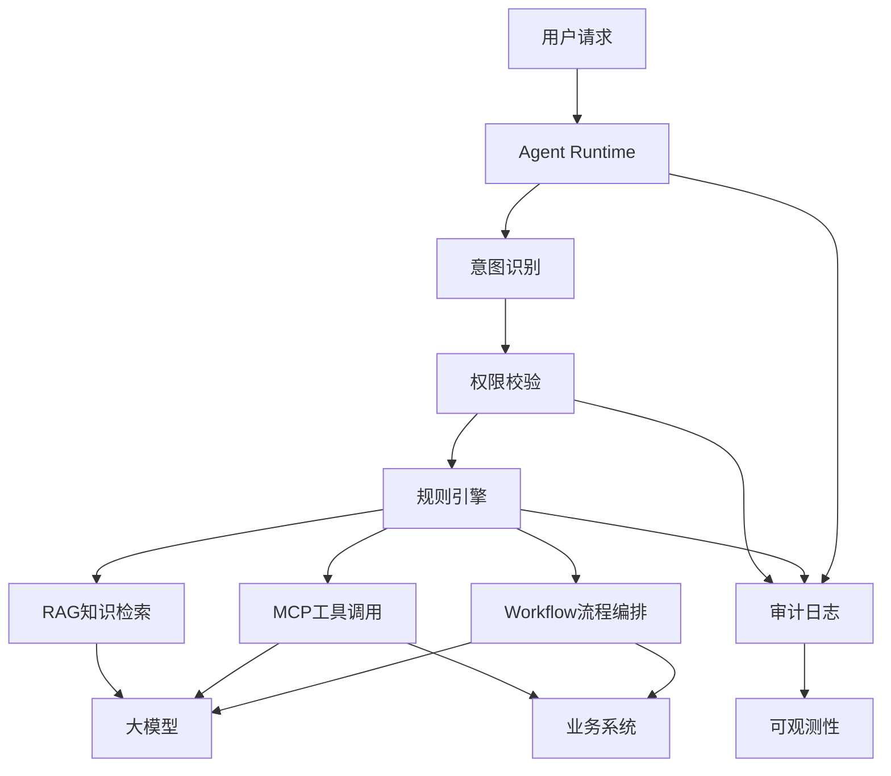

# Agent流程编排与规则引擎设计

版本：v1.0  
更新时间：2026-06-29  
适用对象：企业软件工程师 / 架构师 / 技术负责人  

## 1. 本章核心结论

企业 Agent 流程编排不能把所有判断都交给大模型。确定性判断、业务规则匹配、流程分支、权限判断、数据校验和路由决策应优先由规则引擎、配置中心或业务服务处理，大模型负责理解、生成、归纳和辅助决策。

## 2. 背景与问题

Agent 在企业场景中通常需要跨系统、跨流程、跨权限边界执行任务。如果所有判断都依赖大模型，会带来结果不稳定、性能不可控、权限风险、成本增加和审计困难等问题。

企业 AI 平台需要在 Agent 编排层显式区分三类能力：

1. 确定性规则：由规则引擎、配置中心或业务服务执行。
2. 非确定性理解与生成：由大模型执行。
3. 高风险动作：由人工确认、审批流程或业务系统原生流程执行。

## 3. 核心概念

- 规则引擎：用于执行确定性业务规则、条件判断、路由策略和校验逻辑的组件。
- Agent 编排：将模型调用、知识检索、工具调用、流程节点和人工确认组合为完整任务链路。
- 流程分支：根据规则、上下文、权限和业务状态选择不同执行路径。
- 性能设计：围绕延迟、并发、缓存、异步、超时、降级、追踪和 Token 消耗进行系统设计。

## 4. 规则引擎适用场景

规则引擎适合处理以下场景：

1. 确定性判断：例如员工是否具备某项申请资格。
2. 业务规则匹配：例如薪酬规则、假勤规则、报销规则、采购规则。
3. 流程分支控制：例如金额超过阈值时进入更高级审批。
4. 权限判断：例如用户是否可查看某类薪酬、财务或 ERP 数据。
5. 数据校验：例如表单必填项、字段范围、数据一致性。
6. 路由决策：例如根据业务类型选择 HR Agent、薪酬 Agent、ERP Agent 或 OA Agent。

## 5. Agent编排分层建议

Agent 编排建议采用以下分层：

### 5.0 Agent流程编排与规则引擎关系图

Mermaid 源文件：[Agent流程编排与规则引擎关系图.mmd](../mermaid/09-企业AI平台/Agent流程编排与规则引擎关系图.mmd)

1. 输入理解层：由大模型识别用户意图、任务类型和必要参数。
2. 规则决策层：由规则引擎或业务服务执行确定性判断。
3. 知识检索层：由 RAG 检索制度、流程、FAQ 或系统说明。
4. 工具执行层：由 MCP、业务 API 或 Workflow 执行系统动作。
5. 人工确认层：对高风险动作进行用户确认或审批。
6. 结果生成层：由大模型将结构化结果转化为可读解释。
7. 审计观测层：记录模型调用、规则执行、工具调用和最终输出。

## 6. 性能设计要求

Agent 编排设计必须关注以下性能因素：

1. 规则执行效率：高频规则应本地化、缓存化或预编译，避免每次请求重复加载规则。
2. Agent 多步骤调用耗时：减少不必要的模型调用、工具调用和跨服务调用。
3. 大模型调用延迟：对长文本、复杂推理和多轮调用设置明确预算。
4. 并发请求处理能力：区分同步交互、异步任务和批处理任务。
5. 缓存设计：缓存规则、配置、知识检索结果、低风险查询结果和模型中间结果。
6. 异步任务与消息队列：长流程、批量分析和跨系统任务应通过队列异步处理。
7. 超时控制：为模型、规则、RAG、工具和 Workflow 分别设置超时时间。
8. 降级与兜底策略：当模型、规则服务或业务工具不可用时，返回可解释的兜底结果。
9. 执行链路追踪：使用 traceId 串联输入、规则执行、模型调用、工具调用和输出。
10. Token 消耗控制：限制上下文长度、检索片段数量、模型调用次数和输出长度。

## 7. 企业案例

### HR Agent

员工咨询年假资格时，大模型负责理解问题，规则引擎根据入职日期、员工类型、地区政策和假勤规则判断资格，RAG 提供制度引用，大模型负责生成解释。

### 薪酬 Agent

员工查询薪资差异时，权限判断和敏感字段控制由业务服务或规则引擎完成，大模型只能基于授权后的结构化数据生成解释。

### OA Agent

员工发起报销流程时，规则引擎判断金额阈值、费用类型和审批路径，Workflow 负责执行审批流，大模型负责补全表单和解释流程。

### ERP Agent

采购异常分析中，路由规则决定调用采购、库存或财务工具，业务服务负责数据口径计算，大模型负责汇总原因和建议。

## 8. 技术实现建议

1. 将规则引擎纳入企业 AI 平台基础能力，而不是放在单个 Agent 内部临时实现。
2. 为规则建立版本号、负责人、适用范围、测试用例和变更记录。
3. Agent 设计文档中必须单独列出规则清单、模型判断点、工具调用点、性能预算和降级策略。
4. 规则执行结果应写入 Agent 执行链路，便于审计和问题回放。
5. 对高频规则和配置使用缓存，对高风险规则保留实时校验。
6. 对长耗时 Agent 任务采用异步任务模型，并提供任务状态查询。

## 9. 常见问题

问：规则引擎是否会削弱大模型能力？  
答：不会。规则引擎负责确定性和可审计判断，大模型负责语言理解、生成和复杂上下文归纳，两者是互补关系。

问：所有业务规则都需要规则引擎吗？  
答：不需要。简单且稳定的规则可以放在业务服务或配置中心，复杂、多变、需要业务人员维护的规则更适合规则引擎。

问：性能优化是否等到上线后再做？  
答：不建议。Agent 编排一旦形成多步骤调用链，延迟、Token、并发和超时问题会很快暴露，设计阶段就应明确性能预算。

## 10. 后续延伸

后续需要补充：

1. Agent 编排性能预算模板。
2. 规则清单模板。
3. 规则执行链路追踪字段。
4. 规则引擎与 Workflow、MCP、RAG 的集成架构图。
