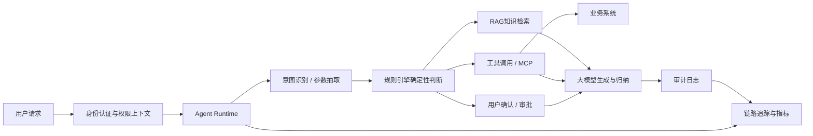

# Agent工程架构

版本：v1.1  
更新时间：2026-06-29  
适用对象：企业软件工程师 / 架构师 / 技术负责人  

## 1. 本章核心结论

企业 Agent 工程架构应把模型调用、任务编排、工具调用、记忆存储、权限审计和监控观测解耦。

生产级 Agent 不是一个简单的聊天接口，而是一套任务运行系统。它需要处理用户身份、上下文、规则判断、知识检索、工具调用、流程状态、异常恢复、成本控制和全链路审计。

确定性判断优先由规则引擎、配置中心或业务服务执行；大模型负责语义理解、生成、归纳和辅助决策；高风险动作必须经过权限校验、用户确认或审批流程。

## 2. 背景与问题

Agent 从 Demo 走向生产后，会遇到并发、超时、重试、权限、审计和成本控制等工程问题。

### 2.1 背景与建设目标

Demo 阶段的 Agent 往往只包含“用户输入 -> 调用模型 -> 返回回答”。企业生产环境中的 Agent 需要面对更多复杂性：

- 同一个用户任务可能需要多次模型调用、多次工具调用和多轮确认。
- Agent 需要访问知识库、业务系统、文件系统和流程引擎。
- 工具调用可能失败、超时、返回脏数据或触发业务风险。
- 不同用户、角色、组织和数据范围对应不同权限。
- 长任务需要状态保存、异步执行、断点恢复和结果通知。
- 每次执行都需要可追踪、可审计、可评估和可复盘。

建设目标是形成稳定的 Agent Runtime，让不同业务 Agent 复用任务状态机、权限校验、工具治理、规则决策、上下文管理和观测审计能力。

## 3. 核心概念

- Agent Runtime：执行 Agent 任务的运行时。
- Tool Registry：管理工具定义、参数和权限。
- Memory Store：保存会话、任务和长期记忆。
- Audit Log：记录关键输入、输出和工具调用。
- Planner：根据用户目标拆解任务步骤，但不替代确定性业务规则。
- Rule Decision：由规则引擎或业务服务执行确定性判断。
- Tool Adapter：把业务 API、MCP 工具、Workflow 和文件能力封装为标准工具。
- Task State：记录 Agent 任务的状态、步骤、输入输出和异常信息。
- Human-in-the-loop：在高风险动作前引入用户确认、专家复核或审批流程。

## 4. 应用架构

建议采用前端工作台、后端 Agent 服务、模型网关、工具服务和数据服务分层架构。

### 4.1 核心架构设计

Agent 工程架构建议包含以下模块：

1. Agent API：接收前端、IM、业务系统或开放接口的任务请求。
2. Identity Context：解析用户身份、组织、角色、租户和数据范围。
3. Agent Runtime：创建任务实例，维护执行状态，编排模型、规则、知识和工具。
4. Context Builder：构造模型上下文，控制 Token、引用来源和敏感信息。
5. Rule Engine Adapter：调用规则引擎、配置中心或业务服务进行确定性判断。
6. Tool Registry：登记工具名称、描述、参数 Schema、权限和风险等级。
7. Tool Executor：执行 MCP、业务 API、Workflow、文件和消息通知工具。
8. Memory Store：保存会话记忆、任务记忆和可复用偏好。
9. Observability：记录 Trace、日志、指标、审计和用户反馈。

### 4.2 关键模块说明

- Agent Runtime：负责执行步骤调度、状态流转、异常恢复和最大步骤控制。
- Context Builder：负责上下文裁剪、敏感信息过滤、知识片段注入和输出格式约束。
- Rule Engine Adapter：负责调用规则服务，返回规则命中、决策结果和解释。
- Tool Executor：负责参数校验、权限校验、超时控制、重试策略和结果规范化。
- Memory Store：负责区分短期会话上下文、任务上下文和长期偏好，避免无限积累。
- Audit Log：负责记录每一步输入、输出、规则、模型和工具调用，支持回放。

### 4.3 状态模型建议

Agent 任务至少应包含以下状态：`CREATED`、`PLANNING`、`WAITING_RULE`、`RETRIEVING`、`CALLING_MODEL`、`CALLING_TOOL`、`WAITING_CONFIRM`、`RUNNING_WORKFLOW`、`COMPLETED`、`FAILED`、`CANCELLED`、`DEGRADED`。

## 5. 工作流程

前端提交任务，后端创建运行实例，Agent Runtime 编排模型与工具，最终写入审计日志并返回结果。

### 5.0 Agent Runtime 执行链路图

Mermaid 源文件：[Agent-Runtime执行链路图.mmd](../../mermaid/03-Agent/Agent-Runtime执行链路图.mmd)

### 5.1 业务流程说明

典型 Agent 执行流程如下：

1. 用户提交自然语言任务，前端携带用户身份和会话上下文。
2. 后端校验用户身份，创建 Agent 任务实例和 traceId。
3. Agent Runtime 识别任务类型，判断是否需要 RAG、规则、工具或 Workflow。
4. 规则引擎先处理确定性判断，例如权限、路由、字段校验和流程分支。
5. 大模型负责理解用户意图、补全缺失信息、归纳上下文和生成说明。
6. Tool Executor 在服务端进行参数校验和权限校验后调用工具。
7. 涉及写操作、敏感数据或审批提交时，进入用户确认或 Workflow。
8. Agent 汇总规则结果、工具返回、知识引用和模型输出，生成最终响应。
9. Observability 模块记录完整链路，供审计、评估和问题排查使用。

### 5.2 大模型与规则边界

大模型可以判断“用户可能想做什么”，但不应直接决定“用户是否有权做”“流程走哪个审批人”“薪酬规则是否命中”“金额是否超阈值”等确定性问题。这些判断应由规则引擎、配置中心或业务服务完成。

## 6. 企业案例

ERP Agent 调用采购、库存、财务接口时，需要按用户角色限制可见数据和可执行动作。

### 6.1 ERP Agent

用户询问“某物料为什么缺货”时，Agent 可以理解问题并规划查询步骤，但库存可见范围、采购单访问权限、供应商数据范围和财务数据口径必须由业务服务和权限系统控制。

### 6.2 HR Agent

员工咨询年假规则时，Agent 可通过大模型理解问题，通过 RAG 检索制度，通过规则引擎根据入职日期、地区和员工类型判断适用规则。

### 6.3 薪酬 Agent

薪资单解释必须先校验用户身份和数据范围。大模型只能基于授权后的薪酬项和规则说明生成解释，不能越权查询或猜测薪资数据。

## 7. 技术实现建议

使用 Spring Boot 承载企业服务和权限，Python 承载算法与 RAG 能力，Vue 承载 Agent 工作台。

### 7.1 工程实现建议

- 后端服务应提供任务创建、任务查询、会话管理、工具执行、确认提交和反馈记录接口。
- Agent 配置应版本化，包含提示词、工具列表、知识库范围、规则策略、模型策略和风险等级。
- 工具调用必须有参数 Schema、权限策略、超时配置、错误码和审计字段。
- 提示词模板不应硬编码在业务代码中，应支持版本、灰度和回滚。
- Agent 输出建议使用结构化中间结果，再由大模型生成自然语言解释。

### 7.2 权限与安全考虑

- 前端不能直接调用模型或业务工具，所有敏感调用必须经过后端。
- 工具授权应按 Agent、用户角色、组织范围和数据域进行控制。
- 高风险工具需要二次确认，必要时进入审批流程。
- Agent 上下文中不应注入用户无权访问的知识片段或业务数据。
- 任务日志中涉及敏感字段时应脱敏或加密存储。

### 7.3 规则引擎与性能设计

- 规则引擎处理权限判断、流程分支、路由决策、字段校验和风险等级判断。
- 配置中心处理模型选择、最大步骤数、超时时间、工具开关和灰度策略。
- 对多步骤任务设置总耗时预算，避免 Agent 在工具和模型之间无限循环。
- 对模型调用设置超时、重试和降级策略，避免阻塞业务流程。
- 高频工具元数据、规则配置和低风险查询结果可缓存。
- 长任务、批量任务和跨系统任务应进入消息队列异步执行。
- Token 成本通过上下文裁剪、知识片段数量限制、模型路由和输出长度控制。

### 7.4 可观测性与审计

Agent 执行链路应记录：任务 ID、traceId、用户身份、Agent 版本、模型调用、提示词版本、规则命中、知识引用、工具调用、确认记录、审批记录、异常信息和最终输出。

关键指标包括：平均响应时间、P95 延迟、模型调用次数、工具调用成功率、超时率、降级率、Token 消耗、人工确认率和用户反馈分。

## 8. 常见问题

问：Agent 服务是否适合直接写在前端？  
答：不适合。工具密钥、业务权限和审计逻辑必须放在后端。

问：Agent 是否应该完全自主规划和执行？  
答：不建议。企业场景需要把确定性规则、权限和高风险动作从模型自主决策中剥离出来。

问：Agent 任务失败时应该怎么处理？  
答：应返回明确失败原因、可重试步骤和兜底入口，例如转人工、重新确认参数或发起传统流程。

## 9. 后续延伸

补充 Agent Runtime 状态机和数据库表设计。

### 9.1 后续待完善事项

1. 绘制 Agent Runtime 状态机图。
2. 补充 Agent 任务表、步骤表、工具调用表和审计表设计。
3. 补充工具注册 Schema 和权限策略模板。
4. 补充 Agent 性能预算和降级策略模板。
5. 补充 Agent 回归评估集设计。
