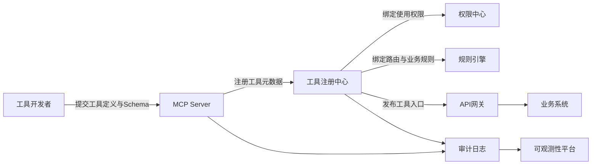
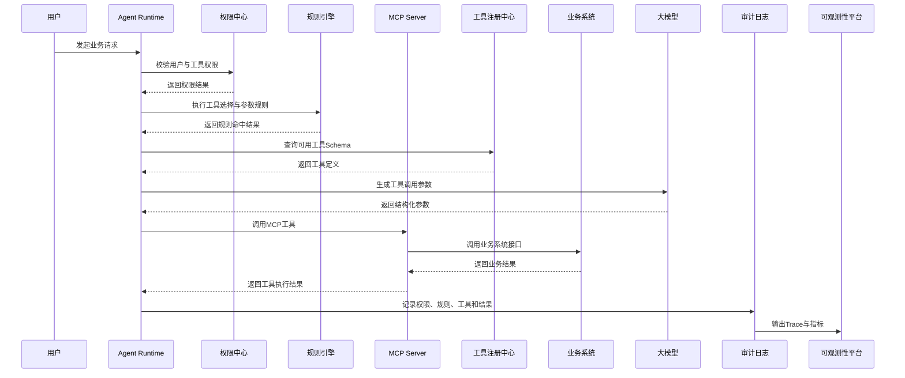

# MCP服务设计

版本：v1.0  
更新时间：2026-06-29  
适用对象：企业软件工程师 / 架构师 / 技术负责人  

## 1. 本章核心结论

MCP 服务设计的重点是工具边界清晰、参数结构稳定、权限可控、错误可解释。

## 2. 背景与问题

如果工具定义过粗或过细，都会影响 Agent 的规划质量和执行稳定性。

## 3. 核心概念

- Tool Schema：工具名称、说明、参数和返回结构。
- Resource：可被读取的上下文资源。
- Error Contract：工具失败时返回的结构化错误。

## 4. 应用架构

MCP Server 应位于业务系统适配层，内部调用企业已有服务或数据库接口。

## 5. 工作流程

梳理业务能力，定义工具契约，接入权限校验，加入日志审计，编写调用样例。

## 6. 企业案例

薪酬 MCP Server 可以提供薪酬项查询、计薪规则查询、薪资单状态查询等工具。

## 7. 技术实现建议

工具描述要写清楚适用场景、禁止场景、参数含义和数据范围。

## 8. 常见问题

问：一个 MCP Server 是否应该包含所有企业工具？  
答：不建议。应按业务域拆分，便于权限隔离和版本管理。

## 9. 后续延伸

补充 MCP 工具命名规范和错误码设计。

## 10. MCP工具注册与调用设计

### 10.1 核心结论

MCP 工具注册与调用设计的核心是把企业业务能力以可治理、可授权、可审计的方式暴露给 Agent。Agent 可以理解用户意图并选择工具，但不能绕过权限中心、规则引擎、参数校验和业务系统的确定性控制。

### 10.2 设计定位

MCP Server 是 Agent Runtime 与企业业务系统之间的工具适配层，不应直接替代业务系统。业务事实、交易写入、金额计算、状态流转和审批条件仍由业务系统、规则引擎或 Workflow 负责。

### 10.3 工具注册设计

工具注册时至少需要沉淀以下元数据：

1. 工具名称、业务域、版本号、负责人和启停状态。
2. 工具说明、适用场景、禁止场景和风险等级。
3. 入参 Schema、出参 Schema、错误码和幂等键规则。
4. 权限策略，包括用户范围、角色范围、数据范围和接口权限。
5. 规则策略，包括参数校验、路由规则、风险命中和审批条件。
6. 审计策略，包括记录字段、敏感字段脱敏和追踪标识。
7. 性能策略，包括超时、限流、重试、缓存和降级方式。

### 10.4 MCP工具注册流程图

Mermaid 源文件：[MCP工具注册流程图.mmd](../../mermaid/04-MCP/MCP工具注册流程图.mmd)

### 10.5 MCP工具调用时序图

Mermaid 源文件：[MCP工具调用时序图.mmd](../../mermaid/04-MCP/MCP工具调用时序图.mmd)

### 10.6 权限、安全与参数校验

MCP 工具调用必须在服务端进行权限校验和参数校验。提示词只能描述安全要求，不能作为最终权限裁决依据。

1. 工具调用前校验用户身份、角色、组织、数据范围和 Agent 使用权限。
2. 高风险工具需要二次确认、审批或 Workflow 节点。
3. 参数必须按 Schema 校验，金额、状态、日期、对象 ID 等关键字段必须由规则引擎或业务服务复核。
4. 敏感字段输出前需要脱敏，并记录脱敏策略和原始数据来源。

### 10.7 规则引擎与工具路由

确定性判断优先交给规则引擎、配置中心或业务系统处理。规则引擎可用于工具可用性判断、工具路由、参数合法性、风险命中、审批条件和降级策略选择。大模型主要负责语义理解、意图识别、参数草拟和结果解释。

### 10.8 审计、性能与异常处理

MCP 工具调用需要记录 traceId、用户、Agent、工具版本、入参摘要、权限结果、规则命中、业务系统返回码、耗时、重试次数和最终输出。高频工具应设计缓存、限流、熔断、超时和异步执行策略。工具异常时应返回结构化错误，避免让 Agent 基于模糊异常继续执行高风险操作。

### 10.9 企业落地建议

企业应先从低风险查询类工具开始接入 MCP，再逐步扩展到流程发起、工单创建、报表生成等半自动操作。涉及金额、合同、发票、支付、退款、结算、用户隐私和业务状态变更的工具，必须接入权限中心、规则引擎、审计日志和人工确认机制。
