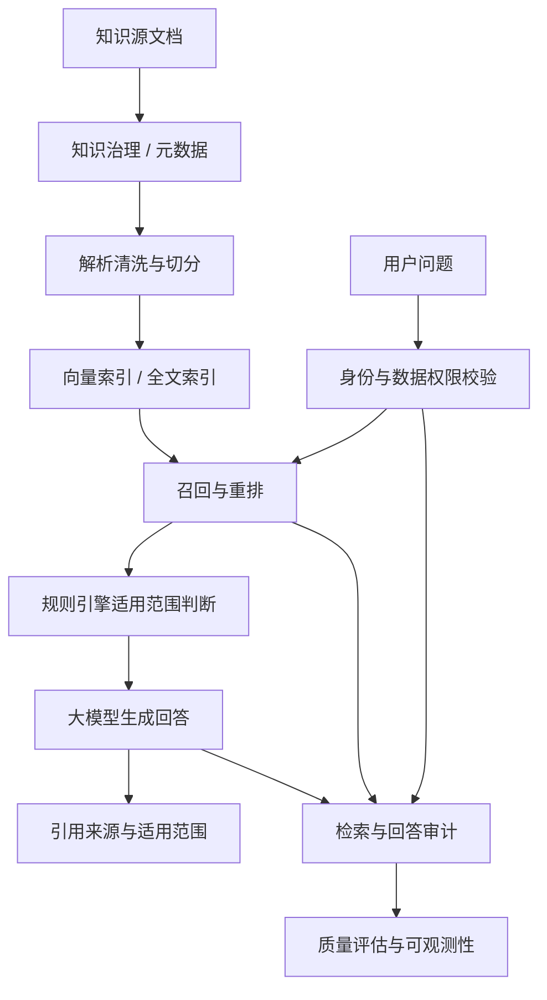
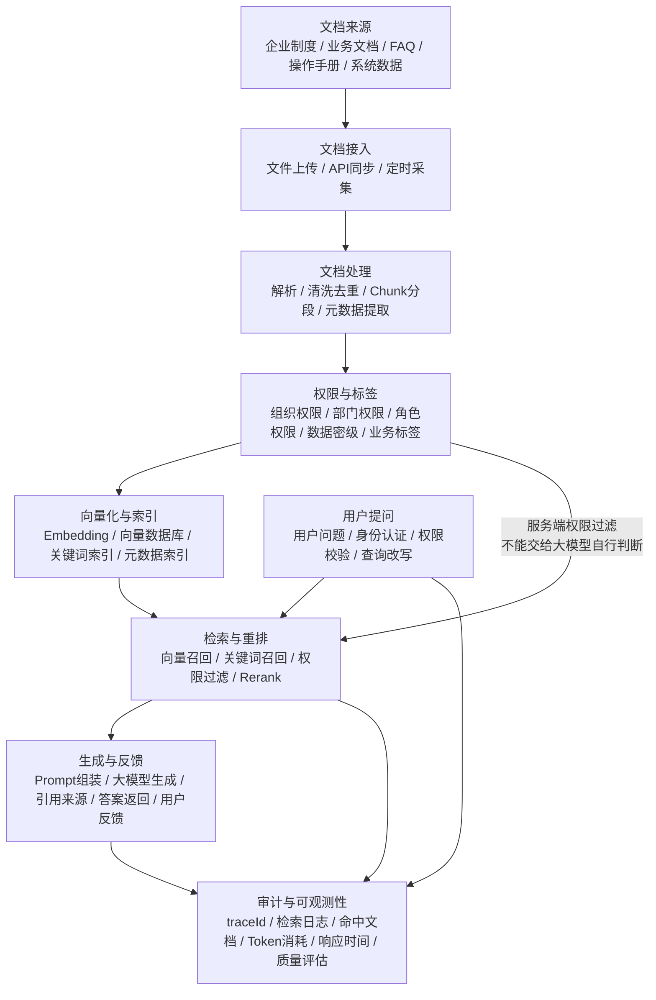

# 企业知识库构建

版本：v1.1  
更新时间：2026-06-29  
适用对象：企业软件工程师 / 架构师 / 技术负责人  

## 1. 本章核心结论

企业知识库建设的关键不是把文档全部向量化，而是建立知识来源、结构、权限、版本和质量治理体系。

企业知识库是 RAG、Agent 问答、流程指引和业务辅助决策的基础。它必须解决“知识是否权威、是否最新、谁能看、能否引用、能否评估、能否追溯”的问题。

涉及制度解释、流程指引、权限判断、薪酬规则和业务处理时，知识库只提供上下文和引用来源，确定性判断仍应由规则引擎、配置中心或业务服务完成。

## 2. 背景与问题

企业文档常见问题包括版本混乱、权限不清、格式不统一、内容重复和责任人缺失。

### 2.1 背景与建设目标

企业内部知识通常分布在网盘、文档系统、Wiki、OA、邮件、业务系统说明、培训材料和个人经验中。直接把这些资料导入向量库会带来明显风险：

- 过期制度和新制度同时被检索，导致回答冲突。
- 文档权限没有继承，导致敏感制度或数据被越权检索。
- 文档缺少元数据，无法判断适用部门、地区、岗位和时间。
- 切分策略不合理，导致检索片段缺少上下文。
- 答案没有引用来源，用户无法验证可靠性。
- 缺少评估集，知识库更新后无法判断效果是否变好。

建设目标是形成企业级知识治理体系，让知识库成为可管理、可检索、可引用、可评估、可审计的基础能力。

### 2.2 知识库边界

知识库不等于业务数据库，也不应替代业务系统的实时查询能力。知识库适合承载制度、流程、规范、FAQ、说明文档和历史案例；实时状态、金额、库存、薪资、审批状态等应通过业务服务或工具查询。

## 3. 核心概念

- 知识源：制度、流程、FAQ、系统手册、业务规范。
- 元数据：文档来源、部门、版本、更新时间、适用范围。
- 权限继承：知识检索必须遵守原始文档权限。
- 知识生命周期：创建、审核、发布、入库、索引、评估、更新、归档。
- Chunk：文档切分后的知识片段。
- Citation：回答中返回的引用来源。
- Retrieval Policy：检索范围、权限过滤、召回数量和重排策略。
- Knowledge Owner：知识责任人，负责内容准确性和更新。

## 4. 应用架构

知识库应包含文档管理、解析切分、索引管理、权限过滤、质量评估和发布管理模块。

### 4.1 核心架构设计

企业知识库建议采用以下架构：

1. 知识源接入层：接入 Markdown、Word、PDF、Wiki、网页、业务系统说明和人工维护文档。
2. 文档治理层：维护来源、版本、责任人、适用范围、保密级别和更新时间。
3. 解析与清洗层：抽取标题、段落、表格、图片说明、附件和结构化元数据。
4. 切分与索引层：按语义、标题层级、表格结构和业务边界生成 Chunk，并建立向量索引和关键词索引。
5. 权限过滤层：在检索前或检索后按用户身份、角色、组织和数据域过滤知识片段。
6. 检索与重排层：结合向量召回、关键词召回、规则过滤和重排模型返回候选片段。
7. 答案生成层：大模型基于授权片段生成回答，并输出引用来源。
8. 评估与运营层：维护评估集、命中率、引用质量、反馈和知识更新任务。

### 4.2 关键模块说明

- 知识源登记：记录知识来源、业务域、责任人、更新周期和权限策略。
- 文档解析：将不同格式转换为统一中间结构，保留标题层级和表格语义。
- 元数据管理：维护部门、岗位、地区、版本、适用时间、保密级别和标签。
- 索引管理：支持向量索引、全文索引和结构化过滤条件。
- 权限过滤：确保用户只能检索其有权访问的知识片段。
- 质量评估：通过标准问题集验证召回、引用和回答质量。
- 反馈闭环：收集用户纠错、无答案问题和转人工问题，用于知识补充。

## 5. 工作流程

梳理知识源，清洗文档，补充元数据，建立索引，验证问答效果，持续更新。

### 5.0 企业知识库 RAG 流程图

Mermaid 源文件：[企业知识库RAG流程图.mmd](../../mermaid/05-RAG/企业知识库RAG流程图.mmd)

### 5.1 业务流程说明

知识库建设流程建议如下：

1. 业务部门提交知识源清单，标明责任人、适用范围和保密级别。
2. 文档进入准入审核，确认是否权威、最新、可公开给目标用户。
3. 系统解析文档并生成结构化内容，人工检查关键制度和表格。
4. 按标题、语义和业务规则切分文档，生成 Chunk 和元数据。
5. 建立向量索引和全文索引，并绑定权限策略。
6. 使用评估集验证检索命中率、引用准确性和回答可信度。
7. 发布到指定知识库范围，供 RAG、Agent 和搜索服务调用。
8. 通过用户反馈和定期巡检持续更新知识。

### 5.2 RAG问答流程

1. 用户提出问题，系统先识别用户身份和权限范围。
2. 规则或配置决定检索的知识库范围、召回数量和是否需要转人工。
3. 检索服务召回候选片段，并按权限、时效和相关性过滤。
4. 大模型基于授权片段生成回答，不得基于无来源内容给出确定性结论。
5. 系统返回答案、引用来源、适用范围和必要风险提示。

## 6. 企业案例

薪酬知识库需要区分员工可见政策、HR 可见规则和薪酬管理员可见计算细节。

### 6.1 HR知识库

HR 知识库可包含员工手册、假勤制度、福利政策、入转调离流程和常见问题。不同地区、员工类型和岗位适用规则可能不同，需要通过元数据和规则引擎判断适用范围。

### 6.2 薪酬知识库

薪酬知识库必须区分政策解释、计薪规则、薪资项说明和管理员操作手册。员工只能检索本人可见政策，薪酬专员可以检索授权范围内的规则说明。

### 6.3 ERP知识库

ERP 知识库可包含业务口径、操作手册、异常处理流程和报表说明。实时库存、订单和财务数据不应作为静态知识存放，而应通过工具查询。

## 7. 技术实现建议

为每类知识设置负责人和更新周期，把过期知识从默认检索范围中移除。

### 7.1 技术实现建议

- 建议以 Markdown 或结构化文档作为中间格式，保留标题层级、表格和引用关系。
- 每个知识片段都应保留 `sourceId`、`docVersion`、`owner`、`updatedAt`、`scope`、`securityLevel` 等元数据。
- 对制度类文档建立生效时间和失效时间，检索时默认排除过期知识。
- 采用向量检索与关键词检索结合，避免只依赖语义相似度。
- 对高价值知识库建立评估集，覆盖高频问题、边界问题和权限问题。
- 对无法回答或低置信度问题提供转人工或提交知识补充入口。

### 7.2 权限与安全考虑

- 知识库权限必须继承原文档权限或由知识责任人明确授权。
- 检索前应先确定用户可访问的知识范围，检索后再次过滤候选片段。
- 敏感制度、薪酬规则、财务说明和客户资料应设置更高保密级别。
- 大模型上下文中不得注入用户无权查看的知识片段。
- 答案输出应避免泄露片段中不必要的敏感信息。

### 7.3 规则引擎与性能设计

- 规则引擎用于判断知识适用范围，例如地区、岗位、员工类型、生效时间和保密级别。
- 确定性业务结论不应只由模型根据知识片段推断，应调用规则或业务服务确认。
- 高频知识库可缓存检索结果、重排结果或标准问答，但必须考虑权限和版本失效。
- 对 RAG 流程设置响应时间预算，包括检索、重排、模型生成和引用拼接。
- 控制召回片段数量和上下文长度，降低 Token 成本。
- 大文档入库、批量重建索引和评估任务应异步执行。

### 7.4 可观测性与审计

知识库审计应记录：用户问题、用户身份、检索范围、召回片段、过滤原因、引用来源、模型回答、反馈结果和知识版本。

关键指标包括：召回命中率、无答案率、引用覆盖率、用户采纳率、错误反馈率、过期知识命中率、平均响应时间和 Token 消耗。

## 8. 常见问题

问：是否所有文档都应该进入知识库？  
答：不应该。应优先选择高频、权威、结构相对清晰的文档。

问：知识库问答能否直接给出业务判断？  
答：知识库可以提供依据和解释，但权限、资格、金额、流程分支等确定性判断应由规则引擎或业务服务确认。

问：知识库是否只需要向量数据库？  
答：不够。企业知识库还需要文档治理、元数据、权限、评估、审计和运营机制。

## 9. 后续延伸

补充知识库准入标准和质量评分表。

### 9.1 后续待完善事项

1. 补充知识源准入清单和知识责任人模板。
2. 补充文档元数据字段规范。
3. 补充 RAG 检索链路和权限过滤流程图。
4. 补充知识库评估集模板。
5. 补充过期知识巡检和用户反馈处理流程。
## RAG 知识数据流图

Mermaid 源文件：[企业知识库RAG知识数据流图.mmd](../../mermaid/05-RAG/企业知识库RAG知识数据流图.mmd)

### 知识数据流说明

RAG 知识数据流需要同时覆盖离线知识入库和在线问答检索两条链路。离线链路负责把企业制度、业务文档、FAQ、操作手册和系统数据转化为可检索、可授权、可追溯的知识资产；在线链路负责在用户提问时完成身份认证、权限校验、检索召回、重排、生成和审计。

权限过滤不能交给大模型自行判断。知识库应在检索服务、权限中心、元数据索引或业务服务侧完成权限过滤，大模型只能基于已授权的片段进行归纳和回答。

### 离线知识入库流程

1. 知识来源通过文件上传、API 同步或定时采集进入知识接入层。
2. 文档处理服务完成解析、清洗、去重、分段 Chunk 和元数据提取。
3. 权限与标签服务写入组织、部门、角色、数据密级和业务标签。
4. Embedding 服务生成向量，写入向量数据库，同时建立关键词索引和元数据索引。
5. 入库过程记录文档版本、处理状态、失败原因和审计日志。

### 在线问答检索流程

1. 用户提问后先完成身份认证、权限校验和查询改写。
2. 检索服务基于向量召回和关键词召回获取候选片段。
3. 权限过滤在服务端执行，只保留用户有权访问的知识片段。
4. Rerank 对候选片段重排，生成 Prompt 所需上下文。
5. 大模型基于授权片段生成回答，并返回引用来源和可追溯信息。
6. 用户反馈进入质量评估，用于优化知识、检索和提示词。

### 权限过滤与审计要求

RAG 链路需要记录 traceId、用户身份、知识库、命中文档、命中片段、权限过滤结果、模型版本、Prompt 版本、Token 消耗、响应时间和用户反馈。涉及敏感知识时，应支持脱敏、最小权限、数据密级和访问留痕。

