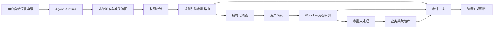

# 企业审批与业务流程编排

版本：v1.1  
更新时间：2026-06-29  
适用对象：企业软件工程师 / 架构师 / 技术负责人  

## 1. 本章核心结论

企业审批场景应以流程引擎为主、Agent 为辅，通过 Agent 降低用户填单和查询成本。

Workflow 是企业 AI 落地中承载确定性流程、人工确认、审批节点和状态追踪的关键能力。Agent 可以帮助用户理解需求、补齐表单、解释流程和查询状态，但不能替代流程引擎、规则引擎和业务系统的确定性控制。

确定性判断优先交给规则引擎、配置中心或业务服务；大模型负责语义理解、字段抽取、说明生成和辅助归纳；高风险操作必须经过权限校验、用户确认或审批流程。

## 2. 背景与问题

审批流程涉及组织、角色、权限、条件分支和合规记录，不能只依赖模型生成结果。

### 2.1 背景与建设目标

企业常见审批包括请假、报销、用章、采购、合同、付款、权限申请、证明开具等。这些流程通常具备明确表单、规则、审批人、状态和审计要求。

传统流程系统的问题是入口难找、表单复杂、规则不透明、状态查询麻烦。引入 Agent 后，可以用自然语言降低使用门槛，但仍需要保持流程执行的确定性和可审计性。

建设目标是形成“Agent 对话入口 + 规则引擎决策 + Workflow 确定性执行 + 业务系统落库 + 审计追踪”的组合架构。

### 2.2 设计边界

Agent 不应直接绕过审批流执行写操作。所有涉及业务数据变更、费用、合同、薪酬、权限、ERP 写入等高风险动作，都应进入用户确认、审批流程或业务系统原生流程。

## 3. 核心概念

- 表单抽取：从自然语言中抽取审批字段。
- 审批路由：根据组织、金额、类型决定流转路径。
- 人工确认：在关键节点要求用户确认。
- 流程实例：一次具体审批或业务流程的运行记录。
- 节点状态：流程在提交、审批、退回、撤销、完成等阶段的状态。
- 规则路由：由规则引擎判断流程分支、审批人和风险等级。
- SLA：流程处理时限和超时提醒策略。
- Human-in-the-loop：在关键决策或写操作前引入人工确认。

## 4. 应用架构

Agent 负责对话和信息补全，Workflow 负责流程执行，业务系统负责数据落库。

### 4.0 Agent + Workflow 审批流程编排图

Mermaid 源文件：[Agent与Workflow审批流程编排图.mmd](../../mermaid/06-Workflow/Agent与Workflow审批流程编排图.mmd)

### 4.1 核心架构设计

企业审批与业务流程编排建议包含以下模块：

1. 对话入口：接收用户自然语言需求，支持多轮补充信息。
2. 表单理解：大模型负责提取字段、识别缺失项和生成表单草稿。
3. 规则引擎：负责审批路由、金额阈值、组织关系、权限判断和字段校验。
4. Workflow 引擎：负责流程实例、节点流转、审批记录、撤回退回和状态查询。
5. 业务服务：负责核心数据校验、业务落库和系统集成。
6. 通知与消息：负责待办、催办、结果通知和异常提醒。
7. 观测与审计：记录用户输入、字段抽取、规则命中、审批节点和最终结果。

### 4.2 关键模块说明

- 表单抽取模块：将用户自然语言转换为结构化字段，并标记置信度和缺失字段。
- 字段校验模块：校验必填项、格式、范围、附件、金额和业务一致性。
- 审批路由模块：根据规则确定审批链路、会签、或签和加签策略。
- 用户确认模块：在提交前展示结构化预览，避免模型误填或漏填。
- Workflow 执行模块：提交流程、查询状态、处理退回和同步结果。
- 异常处理模块：处理流程超时、工具失败、审批人缺失和业务系统不可用。

## 5. 工作流程

用户描述需求，Agent 补齐表单字段，展示确认信息，提交审批，跟踪流程状态。

### 5.1 业务流程说明

典型流程如下：

1. 用户描述需求，例如“帮我申请下周三到周五年假”。
2. Agent 识别流程类型，并抽取请假类型、开始时间、结束时间、原因等字段。
3. 系统调用规则引擎和业务服务校验假期余额、适用制度、组织关系和必填字段。
4. Agent 对缺失字段进行追问，并生成结构化表单预览。
5. 用户确认后，Workflow 引擎创建流程实例。
6. 规则引擎根据组织、金额、类型或风险等级确定审批路径。
7. 审批人处理流程，系统同步状态并向用户返回进度。
8. 流程完成后，业务系统落库，审计系统记录完整链路。

### 5.2 大模型与流程引擎分工

- 大模型处理：意图识别、字段抽取、自然语言解释、补充追问、结果摘要。
- 规则引擎处理：审批路由、字段校验、权限判断、阈值判断、风险等级。
- Workflow 处理：流程实例、节点流转、审批记录、状态查询、退回撤销。
- 业务服务处理：余额校验、费用规则、合同状态、ERP 数据写入等业务事实。

## 6. 企业案例

OA Agent 可帮助员工发起报销、请假、用章、采购和合同审批。

### 6.1 报销审批

用户上传发票和说明后，Agent 抽取费用类型、金额、日期和项目；规则引擎判断费用标准、金额阈值和审批路径；Workflow 负责提交和审批；财务系统负责最终入账。

### 6.2 请假审批

Agent 抽取请假时间和类型，业务服务校验假期余额，规则引擎判断是否需要特殊审批，Workflow 提交流程并同步考勤系统。

### 6.3 合同审批

合同审批涉及金额、合同类型、客户、法务和财务审核。Agent 可辅助生成摘要和风险提示，但审批路径、权限和合同状态必须由规则和业务系统控制。

## 7. 技术实现建议

所有审批提交前必须生成结构化预览，并要求用户确认。

### 7.1 技术实现建议

- 为每类流程建立表单 Schema，明确字段类型、必填规则、默认值和校验规则。
- Agent 抽取字段后应返回结构化 JSON，由后端进行二次校验。
- 流程提交前必须展示表单预览、审批路径和风险提示。
- Workflow 实例应与 Agent 任务 ID 和 traceId 绑定，便于追踪。
- 长流程状态查询应独立于聊天会话，支持任务列表和状态订阅。
- 对审批退回、撤销、超时和审批人变更设计明确异常路径。

### 7.2 权限与安全考虑

- 用户只能发起自己有权发起的流程。
- 审批人、可见字段和附件访问必须遵守组织和角色权限。
- 涉及费用、薪酬、合同、采购、付款等高风险流程时，不能自动提交最终写操作。
- 附件和敏感字段需要脱敏展示或按权限控制下载。
- 审批代理、加签、转交等操作必须保留审计记录。

### 7.3 规则引擎与性能设计

- 规则引擎负责流程分支、审批路由、字段校验、金额阈值和风险等级判断。
- 规则执行结果应返回命中规则、决策结果和解释，供审计和用户说明使用。
- 高频规则和流程配置可缓存，但审批提交前应校验最新关键规则。
- 长流程、批量流程和跨系统处理应使用异步队列。
- 对模型抽取、规则校验、流程提交和业务系统调用分别设置超时。
- 大模型调用次数应受控，优先一次抽取字段，缺失项再追问。
- 当模型不可用时，应降级为传统表单入口；当流程引擎不可用时，应提示稍后重试或转人工。

### 7.4 可观测性与审计

审批编排应记录：用户输入、抽取字段、字段修改、规则命中、审批路径、用户确认、流程实例、节点处理、业务系统写入、异常和最终结果。

关键指标包括：表单一次填写成功率、字段抽取准确率、审批提交耗时、流程平均处理时长、退回率、超时率、降级率和用户满意度。

## 8. 常见问题

问：Agent 能否自动替用户提交审批？  
答：低风险场景可以授权自动提交，高风险场景必须人工确认。

问：审批路由能否由大模型判断？  
答：不建议。审批路由属于确定性规则，应由规则引擎、组织服务或流程引擎处理。

问：Agent 抽取表单字段错误怎么办？  
答：提交前必须展示结构化预览，用户确认后才能提交；高风险字段应由业务服务再次校验。

## 9. 后续延伸

补充审批 Agent 的表单字段映射和异常处理。

### 9.1 后续待完善事项

1. 补充常见审批流程的表单 Schema。
2. 补充审批路由规则模板。
3. 补充 Agent 表单抽取评估集。
4. 补充 Workflow 状态机和异常处理流程图。
5. 补充审批链路审计字段规范。
