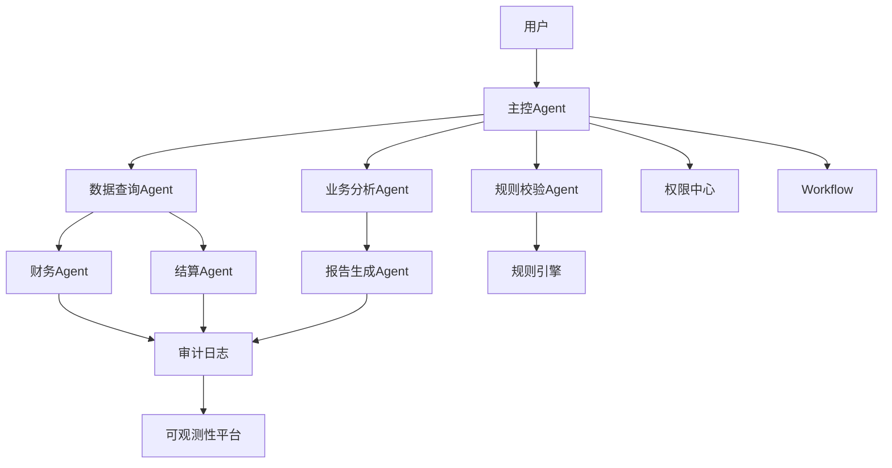
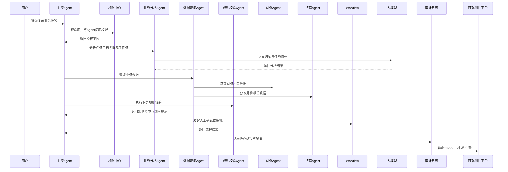

# Multi-Agent协作模式

版本：v1.0  
更新时间：2026-06-29  
适用对象：企业软件工程师 / 架构师 / 技术负责人  

## 1. 本章核心结论

Multi-Agent 适合复杂任务分工，但企业落地应先保证单 Agent 能力稳定，再引入多 Agent 协作。

## 2. 背景与问题

复杂任务可能涉及多个专业领域，例如 HR、财务、法务和 IT，需要多个能力边界清晰的 Agent 协同。

## 3. 核心概念

- Coordinator：协调任务拆解和 Agent 分配。
- Specialist：负责特定业务域的专业 Agent。
- Handoff：一个 Agent 将任务交给另一个 Agent。

## 4. 应用架构

多 Agent 架构通常包含任务协调器、专业 Agent、共享上下文、消息通道和审计系统。

## 5. 工作流程

协调器解析目标，拆解子任务，分配给专业 Agent，汇总结果并处理冲突。

## 6. 企业案例

入职办理可由 HR Agent、IT Agent、OA Agent 和 Office Agent 协同完成。

## 7. 技术实现建议

明确每个 Agent 的职责边界、输入输出契约和失败回退策略。

## 8. 常见问题

问：多 Agent 是否一定比单 Agent 更强？  
答：不一定。多 Agent 会增加协调成本和调试复杂度。

## 9. 后续延伸

补充多 Agent 通信协议和任务分配策略。

## 10. Multi-Agent协作设计

### 10.1 核心结论

Multi-Agent 不是简单增加多个智能体，而是把复杂任务拆成职责边界清晰、输入输出明确、权限可控、过程可审计的协作链路。企业场景应优先保证单个 Agent 稳定，再引入主控 Agent、专业 Agent、规则校验 Agent 和报告生成 Agent 的协作。

### 10.2 适用场景

Multi-Agent 适合跨业务域、跨系统、跨规则的复杂任务，例如用户订单结算财务协同、入职办理、合同审查、供应链异常分析和经营分析报告生成。不适合用来替代简单问答、单系统查询或确定性规则计算。

### 10.3 协作模式

1. 主从式协作：主控 Agent 负责目标识别、任务拆解、子 Agent 调度和结果汇总。
2. 分工协作：不同专业 Agent 分别处理业务分析、数据查询、规则校验、财务分析、结算核对和报告生成。
3. 评审仲裁：评审 Agent 或规则引擎对输出结果进行一致性、风险和合规检查。
4. 业务链路协作：围绕用户、订单、结算、财务等端到端链路组织多个 Agent。
5. 人机协作：高风险动作进入 Workflow，由人工确认、审批或复核。

### 10.4 Multi-Agent协作架构图

Mermaid 源文件：[Multi-Agent协作架构图.mmd](../../mermaid/07-Multi-Agent/Multi-Agent协作架构图.mmd)

### 10.5 Multi-Agent任务协同时序图

Mermaid 源文件：[Multi-Agent任务协同时序图.mmd](../../mermaid/07-Multi-Agent/Multi-Agent任务协同时序图.mmd)

### 10.6 与Workflow和规则引擎的关系

Workflow 负责确定性流程、人工确认、审批节点、长任务状态和失败恢复；规则引擎负责确定性判断、权限边界、路由策略、风险命中和审批条件。Multi-Agent 负责语义理解、任务拆解、上下文汇总和辅助分析，不能替代 Workflow 与规则引擎的最终裁决。

### 10.7 权限、安全与审计

主控 Agent 调度子 Agent 前，需要校验用户是否有使用该 Agent、访问对应数据和调用对应工具的权限。子 Agent 不应继承无限制权限，只能在用户授权范围和平台策略范围内执行。每次 Agent 交接、数据查询、规则校验、工具调用、审批发起和结果生成都需要记录审计日志。

### 10.8 性能与稳定性设计

Multi-Agent 会增加步骤数、模型调用次数、工具调用次数和调试复杂度。设计时应限制最大协作轮次、最大子任务数、最大 Token 预算和最大执行时长；对数据查询、规则校验和低风险摘要使用缓存；对长任务使用异步队列；对部分 Agent 失败设置降级策略；对全链路生成统一 traceId。

### 10.9 企业落地建议

企业落地 Multi-Agent 时，应从“主控 Agent + 2 到 3 个专业 Agent”的小规模协作开始，优先选择查询、分析、报告类场景。涉及财务、合同、订单、结算、发票、付款、退款和个人隐私的任务，必须引入权限校验、规则引擎、人工确认、审批流程和审计留痕。
