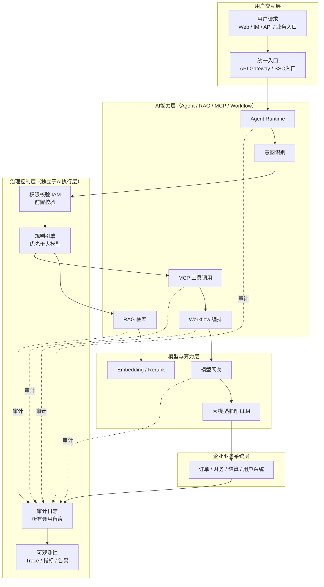
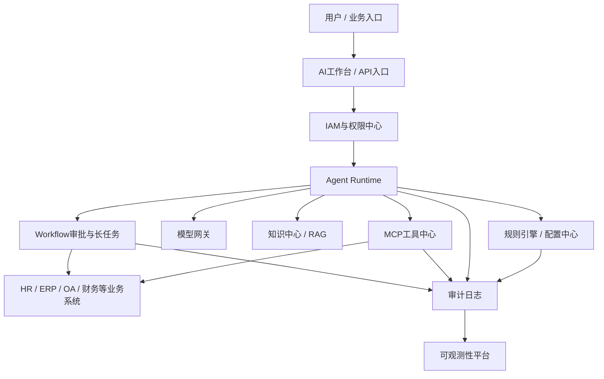
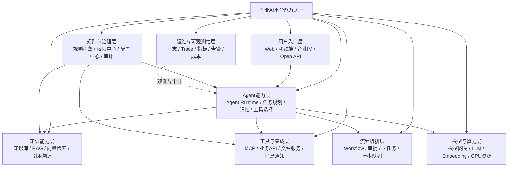
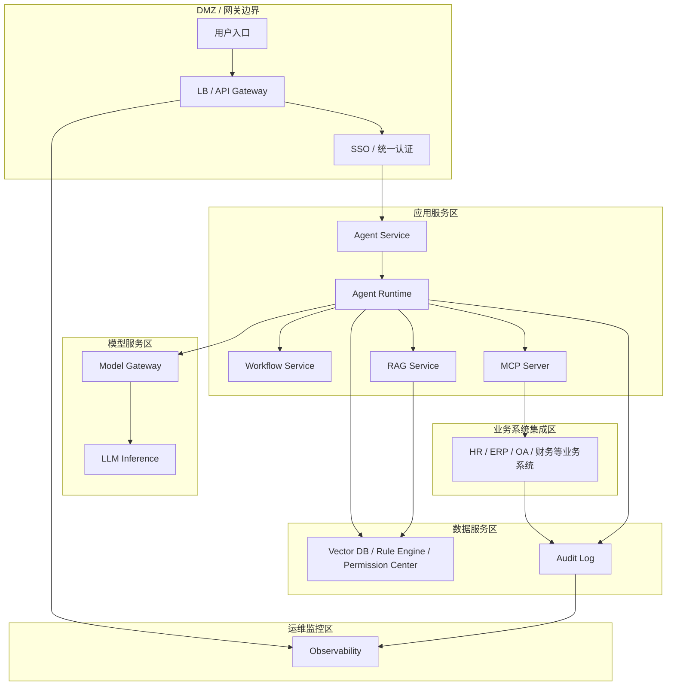

# 企业AI平台总体架构

版本：v1.1  
更新时间：2026-06-29  
适用对象：企业软件工程师 / 架构师 / 技术负责人  

## 企业AI平台总控架构图（核心）

Mermaid 源文件：[企业AI平台总控架构图.mmd](../../mermaid/09-企业AI平台/企业AI平台总控架构图.mmd)

本图是企业 AI 平台的全局唯一总控图，用于战略汇报、架构评审和方案总览。它定义本项目后续所有 Agent、RAG、MCP、Workflow、权限、安全、审计、模型服务和业务系统集成设计的统一参照。

旧“企业AI平台总体架构图”保留为模块视角图，用于说明平台模块组成；本“企业AI平台总控架构图”是 Single Source of Truth，用于说明全局分区、治理边界和关键执行链路。其他流程图、时序图、数据流图、领域模型图都应向本图对齐。

总控架构图明确 5 大分区：

1. 用户交互层：承接用户请求、统一入口、SSO 和 API Gateway。
2. AI 能力层：承载 Agent Runtime、意图识别、RAG、MCP 和 Workflow。
3. 治理控制层：承载 IAM、规则引擎、审计日志和可观测性，并独立于 AI 执行层。
4. 模型与算力层：承载模型网关、LLM、Embedding 和 Rerank。
5. 企业业务系统层：承载订单、财务、结算、用户等核心业务系统。

总控链路必须遵循三条原则：权限前置、规则优先、全链路可审计。权限校验不能后置到大模型输出阶段；确定性规则优先由规则引擎、配置中心或业务服务处理；所有 Agent、RAG、MCP、Workflow、模型和业务系统调用都必须进入审计和可观测性链路。

## 1. 本章核心结论

企业 AI 平台应统一承载模型、知识、工具、Agent、Workflow、权限、审计和可观测能力。

平台建设的重点不是把多个 AI Demo 拼在一起，而是形成企业级的统一底座：模型统一接入、知识统一治理、工具统一注册、Agent 统一运行、流程统一编排、权限统一控制、日志统一审计、成本统一度量。

确定性判断必须优先交给规则引擎、配置中心或业务服务处理；大模型负责语义理解、内容生成、上下文归纳和辅助决策；高风险操作必须经过权限校验、用户确认或审批流程。

## 2. 背景与问题

单个 AI 应用容易快速上线，但长期会形成模型接入混乱、知识重复建设和权限不可控的问题。

### 2.1 背景与建设目标

企业内部通常同时存在 HR、薪酬、ERP、OA、Office、财务、制造等多个业务系统。如果每个系统独立建设 AI 能力，会出现以下问题：

- 模型接入重复，成本、限流、审计和密钥管理分散。
- 知识库重复建设，文档版本、权限和引用来源难以统一。
- Agent 工具调用缺少统一治理，容易产生越权访问和错误执行。
- 流程编排缺少统一状态管理，长任务、审批和异常恢复难以追踪。
- 业务规则混入提示词，导致确定性判断不稳定、不可审计。
- 缺少可观测性，问题发生后难以还原模型、知识、工具和流程调用链路。

建设目标是形成一个可复用的平台能力层，让不同业务 Agent 复用同一套模型网关、知识中心、工具中心、规则引擎、Workflow、权限安全和可观测体系。

### 2.2 平台边界

企业 AI 平台不替代 HR、ERP、OA 等业务系统，而是作为智能交互、知识增强、任务编排和工具治理层接入现有系统。业务事实、交易数据和核心写操作仍由原业务系统承担。

## 3. 核心概念

- 模型网关：统一模型调用和成本控制。
- 知识中心：统一知识入库、索引和权限。
- Agent 中心：统一 Agent 配置、运行和评估。
- 工具中心：统一业务工具注册和治理。
- 规则引擎：处理确定性判断、流程分支、权限判断、数据校验和路由决策。
- Workflow：承载确定性流程、审批节点、长任务状态和人工确认。
- 可观测平台：追踪一次 AI 任务从输入到输出的全链路。
- 治理运营：围绕效果、成本、安全、知识质量和用户反馈持续运营平台。

## 4. 应用架构

平台分层包括入口层、Agent 编排层、AI 能力层、业务工具层、数据知识层和治理观测层。

### 4.0 企业AI平台总体架构图

Mermaid 源文件：[企业AI平台总体架构图.mmd](../../mermaid/09-企业AI平台/企业AI平台总体架构图.mmd)

### 4.1 核心架构设计

建议采用以下逻辑分层：

1. 入口层：Web 工作台、移动端、企业 IM、业务系统插件和开放 API。
2. 身份与权限层：统一认证、组织角色、数据权限、工具权限、敏感字段策略。
3. Agent 编排层：Agent Runtime、任务状态机、上下文管理、工具选择、人工确认。
4. 规则与流程层：规则引擎、配置中心、Workflow、消息队列、任务调度。
5. AI 能力层：模型网关、提示词模板、结构化输出、模型评估、Token 成本控制。
6. 知识与数据层：知识库、向量索引、元数据、权限过滤、业务数据查询。
7. 工具与集成层：MCP Server、业务 API、RPA、文件服务、通知服务。
8. 治理观测层：日志、Trace、指标、审计、反馈、告警、质量评估。

### 4.2 关键模块说明

- 模型网关：负责模型路由、调用鉴权、限流、超时、重试、日志和 Token 统计。
- 知识中心：负责知识源登记、文档解析、切分、索引、权限过滤、引用返回和质量评估。
- Agent 中心：负责 Agent 定义、版本、提示词、工具授权、运行策略和效果评估。
- 工具中心：负责工具注册、参数 Schema、权限策略、调用审计和下线机制。
- 规则引擎：负责稳定规则计算，避免把审批路由、薪酬规则、权限判断等交给大模型。
- Workflow：负责长流程、审批、人工确认、状态恢复和业务系统写操作。
- 可观测与审计：负责串联用户输入、规则执行、模型调用、RAG 检索、工具调用和输出结果。

## 5. 工作流程

业务应用接入平台，平台完成权限校验、Agent 编排、知识检索、工具调用和审计记录。

### 5.1 业务流程说明

典型流程如下：

1. 用户从工作台、IM 或业务系统发起问题或任务。
2. 平台完成身份认证，加载用户角色、组织、数据范围和工具权限。
3. Agent Runtime 识别任务意图，并判断是否需要知识检索、规则判断、工具调用或流程发起。
4. 规则引擎或业务服务先处理确定性判断，例如权限、数据校验、流程分支和路由决策。
5. RAG 检索相关知识并按权限过滤，返回可引用片段。
6. 大模型基于用户输入、规则结果、检索结果和工具返回内容生成解释或下一步建议。
7. 涉及写操作、高风险查询或审批提交时，进入用户确认或 Workflow 审批。
8. 平台记录完整执行链路，包括模型、知识、规则、工具、审批和最终输出。

### 5.2 规则引擎与大模型分工

- 规则引擎处理：确定性规则、权限判断、数据校验、审批路由、工具路由、阈值判断。
- 配置中心处理：开关、限流、模型路由策略、场景参数、灰度策略。
- 业务服务处理：核心业务数据查询、交易写入、规则口径计算。
- 大模型处理：自然语言理解、上下文归纳、解释生成、摘要生成、辅助建议。

## 6. 企业案例

同一平台可同时支撑 HR Agent、薪酬 Agent、Office Agent 和 ERP Agent。

### 6.1 HR Agent

HR Agent 使用知识中心回答制度问题，使用规则引擎判断员工适用范围，使用 OA Workflow 发起证明、请假等流程。

### 6.2 薪酬 Agent

薪酬 Agent 必须先进行身份和数据权限校验，只能基于授权后的结构化数据生成解释；薪酬规则匹配和敏感字段脱敏由业务服务或规则引擎完成。

### 6.3 Office Agent

Office Agent 负责文档、表格和汇报材料生成，引用来源和素材权限由知识中心控制，正式发布前应保留人工审核。

### 6.4 ERP Agent

ERP Agent 主要承担跨模块查询、报表解释和异常分析。采购、库存、财务等写操作必须通过 ERP 原有权限和审批流程执行。

## 7. 技术实现建议

采用 Java / Spring Boot 作为企业服务底座，Vue 构建管理和工作台，Python 承载 RAG 与模型实验。

### 7.1 工程实现建议

- Java / Spring Boot：承载统一认证、权限校验、Agent 服务、工具适配、审计日志和管理后台。
- Vue：承载 Agent 工作台、知识库管理、工具管理、规则配置和任务观测界面。
- Python：承载文档解析、Embedding、RAG 检索、重排、评估和模型实验能力。
- MCP：封装业务系统工具，统一工具描述、参数、返回结构和错误处理。
- Workflow：承载审批、长任务、人工确认和跨系统写操作。

### 7.2 权限与安全考虑

- 所有入口请求必须绑定用户身份和组织上下文。
- RAG 检索必须执行文档级、片段级或数据域权限过滤。
- 工具调用必须在服务端校验权限，不能只依赖提示词约束。
- 高风险操作必须提供结构化预览、用户确认和审批记录。
- 敏感数据输出前必须进行脱敏、最小化展示和审计记录。

### 7.3 规则引擎与性能设计

- 高频规则应缓存或预编译，避免每次请求重复加载。
- 模型调用前应先执行规则和配置判断，减少不必要的 Token 消耗。
- 多步骤 Agent 任务应设置最大步骤数、最大工具调用次数和超时预算。
- 长流程、批量分析、跨系统任务应进入异步队列。
- 常用知识检索结果、低风险配置和工具元数据可以缓存。
- 平台应设计降级策略，例如模型不可用时返回流程指引，RAG 不可用时提示转人工。

### 7.4 可观测性与审计

每次任务应生成 traceId，贯穿入口请求、意图识别、规则执行、RAG 检索、模型调用、工具调用、Workflow 节点和最终输出。

审计日志至少应包含：用户身份、请求时间、Agent 版本、提示词版本、模型版本、知识引用、规则命中、工具调用、审批记录、输出结果和用户反馈。

## 8. 常见问题

问：企业 AI 平台是否必须一次建完？  
答：不需要。应按模型网关、知识中心、Agent 中心、工具中心逐步演进。

问：是否可以把业务规则写进提示词？  
答：不建议。提示词可以描述规则背景，但确定性判断应由规则引擎、配置中心或业务服务执行。

问：平台建设最容易被忽略的能力是什么？  
答：权限过滤、审计追踪、质量评估和成本控制。这些能力决定平台是否能进入生产。

## 9. 后续延伸

补充平台模块图、部署图和数据库模型。

### 9.1 后续待完善事项

1. 绘制企业 AI 平台总体架构图和部署拓扑图。
2. 补充模型网关、知识中心、Agent 中心、工具中心的接口设计。
3. 补充规则引擎与 Workflow 的集成架构。
4. 补充统一审计日志字段和 traceId 规范。
5. 补充平台性能预算模板和容量评估方法。

## 企业AI平台能力地图

Mermaid 源文件：[企业AI平台能力地图.mmd](../../mermaid/09-企业AI平台/企业AI平台能力地图.mmd)

企业 AI 平台能力地图用于回答“平台到底提供哪些统一底座能力”。它不替代具体业务系统，而是把模型、知识、Agent、MCP 工具、Workflow、规则治理、权限审计和可观测性能力沉淀为可复用平台能力。

能力地图建议按以下层次理解：

1. 用户入口层：面向业务用户、管理后台、企业 IM、开放 API 和业务系统插件。
2. Agent 能力层：承载 Agent Runtime、任务规划、上下文管理、工具选择、人工确认和执行状态。
3. 知识能力层：承载知识库、RAG、向量检索、权限过滤、引用溯源和质量评估。
4. 工具与集成层：承载 MCP Server、业务 API、文件服务、消息通知和第三方系统适配。
5. 流程编排层：承载 Workflow、审批、长任务、异步队列、补偿和状态恢复。
6. 规则与治理层：承载规则引擎、配置中心、权限中心、审计日志和风险策略。
7. 模型与算力层：承载模型网关、LLM、Embedding、重排模型、GPU 资源和成本控制。
8. 运维与可观测性层：承载日志、Trace、指标、告警、质量评估和 Token 成本监控。

## 企业AI平台部署架构图

Mermaid 源文件：[企业AI平台部署架构图.mmd](../../mermaid/09-企业AI平台/企业AI平台部署架构图.mmd)

部署架构图用于回答“平台在企业私有化环境中如何部署”。企业落地时应明确网络边界、应用服务边界、数据服务边界、模型服务边界、运维监控边界和业务系统集成边界，避免 Agent 直接越过权限中心和业务服务访问底层数据。

部署设计要点：

1. 用户入口统一经过 LB、API Gateway 和 SSO，所有请求绑定用户身份、组织、角色和数据范围。
2. Agent Service 与 Agent Runtime 位于应用服务区，负责意图识别、编排、上下文管理和工具调用调度。
3. Workflow、MCP Server、RAG Service 独立部署，便于扩容、限流、隔离和审计。
4. 向量数据库、规则引擎、权限中心和审计日志属于数据与治理能力，不能由大模型绕过。
5. 模型网关统一管理大模型推理服务，承担模型路由、超时、限流、Token 统计和降级。
6. 可观测性平台需要覆盖网关、Agent Runtime、MCP、RAG、Workflow、模型网关和业务系统调用链路。

