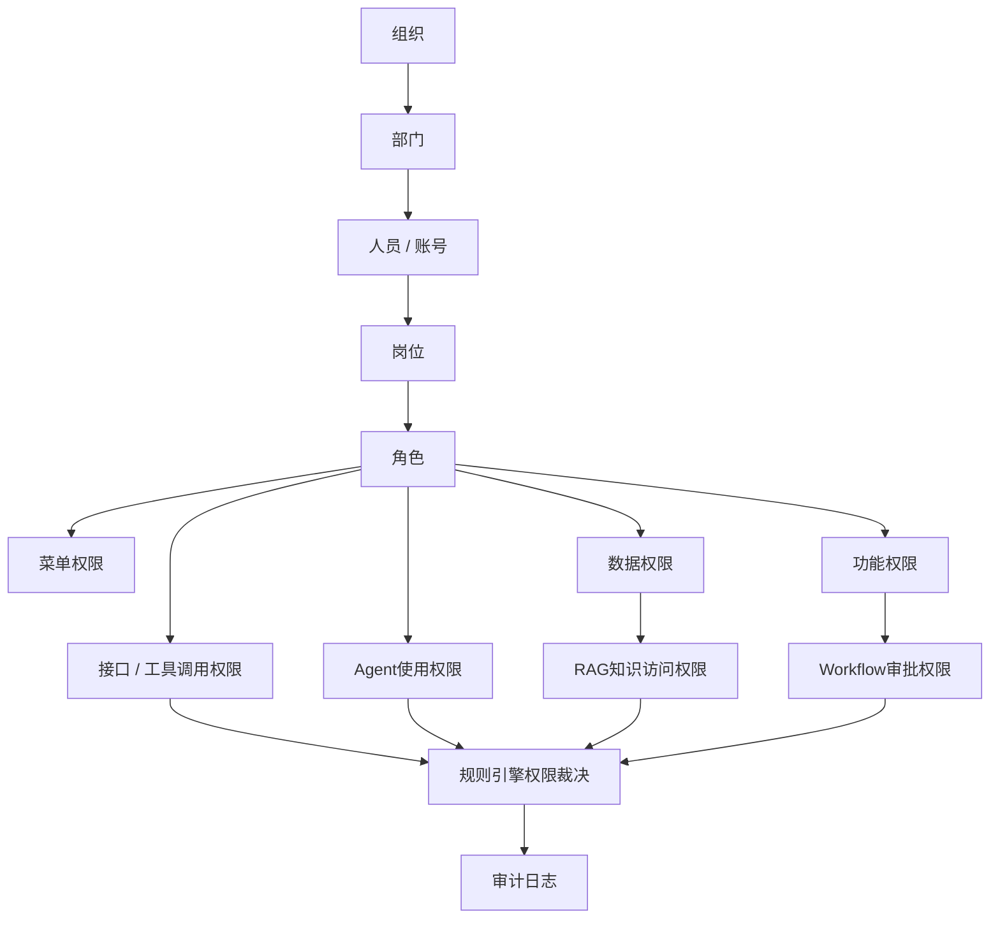

# 组织与权限基础能力设计

版本：v1.0  
更新时间：2026-06-29  
适用对象：企业软件工程师 / 架构师 / 技术负责人  

## 1. 本章核心结论

组织、部门、人员、岗位、角色、菜单、权限是企业 AI 平台的基础主数据，也是所有 Agent、RAG、Workflow、MCP 和业务系统集成的统一底座。

Agent 不应绕过企业现有权限体系直接访问知识库、工具或业务系统。用户访问 Agent 前需要进行身份认证和权限校验；Agent 查询知识库、调用工具、访问业务系统、执行操作时，还需要进行二次权限判断。

权限判断应优先由 IAM、权限中心、规则引擎或业务系统处理，不能依赖大模型自行判断。大模型主要负责语义理解、内容生成和辅助分析，不负责最终权限裁决。所有权限判断结果都需要记录到审计日志中。

## 2. 背景与建设目标

企业 AI 平台一旦接入 HR、薪酬、ERP、OA、Office、财务、合同、订单等系统，就不再只是问答工具，而是企业数字化入口的一部分。如果缺少统一组织和权限底座，Agent 可能出现越权检索、越权调用工具、越权执行流程、敏感数据泄露和审计不可追溯等问题。

建设目标：

1. 建立统一组织、部门、人员、账号、岗位、角色、菜单和权限模型。
2. 为 Agent、RAG、Workflow、MCP、业务系统集成提供统一身份与权限上下文。
3. 支持菜单权限、功能权限、数据权限、接口权限、工具调用权限、Agent 使用权限和审批权限。
4. 对薪酬、财务、合同、订单、结算、发票、用户隐私等敏感数据提供脱敏、最小权限和审计追踪。
5. 将权限判断从大模型中剥离，交给 IAM、权限中心、规则引擎或业务系统执行。

## 3. 基础能力范围

企业 AI 平台基础能力至少包括：

- 组织体系：集团、公司、事业部、分支机构等组织层级。
- 部门体系：部门树、虚拟部门、成本中心、业务线。
- 人员与账号：员工、外包、供应商、系统账号、机器人账号。
- 岗位与角色：岗位、职级、业务角色、系统角色、审批角色。
- 菜单权限：用户可见的页面、模块和导航入口。
- 功能权限：按钮、操作、导出、上传、审批、配置等功能点。
- 数据权限：组织范围、部门范围、岗位范围、本人、下属、自定义范围。
- 接口权限：API、MCP Server、业务服务接口访问权限。
- 工具调用权限：Agent 可调用工具、用户可触发工具、工具参数范围。
- Agent 使用权限：用户可使用哪些 Agent、哪些能力和哪些模型策略。
- 审批权限：发起、审批、转交、加签、撤回、查看等流程权限。
- 审计日志：记录认证、授权、拒绝、调用、确认、审批和敏感数据访问。

### 3.1 组织、人员、菜单、权限基础能力关系图

Mermaid 源文件：[组织与权限基础能力关系图.mmd](../../mermaid/09-企业AI平台/组织与权限基础能力关系图.mmd)

## 4. 组织体系设计

组织体系用于表达企业法人、集团、分子公司、区域、事业部等宏观结构。它是数据权限、审批路由、成本归属、租户隔离和业务系统集成的重要依据。

设计建议：

1. 支持多级组织树，保留组织编码、组织名称、父级组织、组织类型、状态和生效时间。
2. 支持组织变更历史，避免人员调动后历史审批和审计记录无法还原。
3. 支持组织与业务系统编码映射，例如 ERP 公司编码、HR 公司编码、财务主体编码。
4. 支持组织级权限边界，例如某 Agent 仅对指定组织开放。

Agent 使用组织信息时，只能读取平台授权后的组织上下文，不能自行推断用户组织范围。

## 5. 部门体系设计

部门体系用于表达企业内部管理和业务协作结构。部门通常与人员归属、数据范围、审批路径和知识适用范围直接相关。

设计建议：

1. 支持部门树、部门负责人、上级部门、部门状态和排序。
2. 支持人员主部门和兼职部门，避免多部门人员权限缺失。
3. 支持虚拟部门和项目组，用于跨部门协作场景。
4. 支持部门与成本中心、业务线、区域的映射。
5. 支持部门变更记录，保证历史流程和审计可追溯。

数据权限需要结合部门范围控制，例如本人部门、本部门及下级部门、指定部门集合、跨部门项目组等。

## 6. 人员与账号体系设计

人员表示企业真实主体，账号表示系统登录和调用身份。一个人员可能拥有多个账号，一个账号也可能代表系统集成或机器人。

设计建议：

1. 人员信息包含员工编号、姓名、组织、部门、岗位、状态、入离职时间和联系方式。
2. 账号信息包含账号 ID、登录名、认证方式、绑定人员、账号类型和状态。
3. 支持员工、外包、供应商、访客、系统账号、Agent 机器人账号等类型。
4. 离职、停用、冻结账号必须立即影响 Agent、工具和知识库访问权限。
5. 系统账号和机器人账号必须具备明确负责人、用途、有效期和审计策略。

Agent 执行任务时必须绑定发起用户身份；后台自动任务和系统 Agent 也必须绑定系统账号、授权范围和责任人。

## 7. 岗位与角色体系设计

岗位描述人员在组织中的职责，角色描述系统或业务权限集合。岗位和角色都可以影响数据权限、功能权限和审批权限。

设计建议：

1. 岗位用于表达 HR 管理意义上的职位、职级、职务和职责。
2. 角色用于表达系统权限集合，例如员工、主管、HRBP、薪酬专员、财务审批人、ERP 管理员。
3. 支持岗位到角色的默认映射，但允许按人员或组织做补充授权。
4. 支持临时角色、项目角色和审批角色，并设置有效期。
5. 高敏角色需要审批授权和定期复核。

大模型可以解释角色含义，但不能决定用户是否拥有角色；角色授予和撤销必须由权限中心或业务系统执行。

## 8. 菜单与功能权限设计

菜单权限控制用户能看到哪些页面、模块和导航入口；功能权限控制用户能执行哪些具体动作。

设计建议：

1. 菜单权限包括平台管理、Agent 工作台、知识库管理、工具管理、流程管理、审计中心等入口。
2. 功能权限包括新增、编辑、删除、导入、导出、发布、审批、配置、调用、停用等动作。
3. 前端根据权限展示菜单和按钮，但后端必须再次校验权限。
4. Agent 工作台中可见 Agent、可用工具和可执行动作都应受功能权限控制。
5. 导出、批量操作、敏感配置和工具发布应作为高风险功能单独授权。

菜单隐藏不能替代后端权限校验。任何接口、工具或流程操作都必须在服务端验证。

## 9. 数据权限设计

数据权限决定用户可以访问哪些业务数据和知识内容。它需要结合组织、部门、岗位、角色、人员范围、数据分类和业务对象共同判断。

常见数据范围：

1. 本人数据。
2. 本部门数据。
3. 本部门及下级部门数据。
4. 指定组织或部门数据。
5. 指定项目、客户、供应商、订单或业务对象数据。
6. 按岗位、角色或审批关系授权的数据。
7. 跨系统自定义数据范围。

敏感数据要求：

- 薪酬、财务、合同、订单、结算、发票、用户隐私等数据默认采用最小权限。
- 输出前需要按角色和场景脱敏，例如只展示部分字段或区间信息。
- 查询、导出、复制、分享和工具调用都需要记录审计日志。
- 大模型上下文中不得注入用户无权查看的数据。

## 10. 接口与工具调用权限设计

接口权限控制系统服务能否被调用，工具调用权限控制 Agent 能否代表用户触发某个工具。

设计建议：

1. 每个 API、MCP Tool、业务服务接口都应登记资源类型、动作、风险等级和权限策略。
2. 工具调用需要同时校验 Agent 权限、用户权限、参数权限和数据权限。
3. 写操作工具、导出工具、批量操作工具和跨系统工具应配置更高风险等级。
4. 工具参数必须做 Schema 校验、数据范围校验和业务规则校验。
5. 工具调用结果进入大模型前，应进行权限过滤和敏感字段处理。

Agent 不能因为“用户要求”就调用未授权接口，也不能通过自然语言构造越权参数。

## 11. Agent 使用权限设计

Agent 使用权限决定用户可以使用哪些 Agent，以及每个 Agent 中哪些能力可用。

设计建议：

1. 按业务域授权 Agent，例如 HR Agent、薪酬 Agent、Office Agent、ERP Agent。
2. 按能力授权功能，例如问答、分析、导出、流程发起、工具调用、批量处理。
3. 按风险等级控制是否需要二次确认、审批或管理员授权。
4. 按组织、部门、角色、岗位和人员范围配置 Agent 可见性。
5. Agent 配置变更、工具授权变更和模型策略变更必须记录审计。

用户访问 Agent 前必须完成身份认证和权限校验。Agent 执行过程中还需要根据具体动作进行二次权限判断。

## 12. RAG 知识库访问权限设计

RAG 知识库权限应继承知识源权限，并支持知识库、文档、章节、片段等多层级控制。

设计建议：

1. 知识源入库时必须登记 owner、部门、保密级别、适用范围、版本和权限策略。
2. 检索前根据用户身份确定可访问知识范围。
3. 检索后对候选片段再次做权限过滤。
4. 引用来源必须保留文档 ID、版本、更新时间和片段位置。
5. 对薪酬、法务、财务、客户和隐私类知识设置更严格权限。

大模型只能基于授权后的知识片段回答问题，不能根据无权知识或猜测内容生成确定性结论。

## 13. Workflow 审批权限设计

Workflow 审批权限控制用户能否发起、审批、查看、撤回、转交、加签和管理流程。

设计建议：

1. 发起权限：用户是否可发起某类流程。
2. 审批权限：用户是否可处理当前节点。
3. 查看权限：用户是否可查看流程详情、附件和历史记录。
4. 操作权限：撤回、转交、加签、催办、作废等操作是否允许。
5. 路由权限：审批路径由规则引擎、组织关系或流程引擎决定。

高风险流程必须经过用户确认或审批，不允许 Agent 绕过 Workflow 直接写入业务系统。

## 14. 审计日志与操作留痕

所有权限判断结果都需要记录到审计日志中，尤其是敏感数据访问、工具调用、权限拒绝、高风险操作和审批动作。

审计日志建议包含：

- 用户身份、账号类型、组织、部门、角色。
- Agent、知识库、工具、接口、流程等资源对象。
- 操作类型、请求参数、数据范围、风险等级。
- 权限判断结果、规则命中、允许或拒绝原因。
- 模型调用、知识引用、工具调用、审批确认。
- traceId、任务 ID、会话 ID、时间戳、客户端信息。

审计日志本身也属于敏感数据，需要权限控制、脱敏展示、保留周期和防篡改机制。

## 15. 与业务系统集成方式

企业 AI 平台应复用现有 IAM、组织人员系统、权限中心、HR 系统、OA 系统、ERP 系统和数据平台能力。

集成方式：

1. 主数据同步：从 HR、IAM 或主数据系统同步组织、部门、人员、岗位和角色。
2. 实时查询：对权限敏感或变化频繁的数据，通过业务系统实时接口查询。
3. 事件订阅：监听入职、离职、调岗、角色变更、组织调整等事件。
4. 权限委托：由业务系统保留最终权限裁决，AI 平台只做编排和调用。
5. 编码映射：维护 AI 平台与业务系统之间的组织、人员、角色和业务对象编码映射。

不建议在 AI 平台中复制并独立维护一套与业务系统脱节的权限体系。

## 16. 规则引擎与权限判断

权限判断应优先由 IAM、权限中心、规则引擎或业务系统处理。规则引擎适合处理以下场景：

1. 数据范围判断：用户是否可访问某组织、部门、人员或业务对象。
2. 工具路由判断：当前任务应调用哪个业务域工具。
3. 风险等级判断：是否需要二次确认、审批或转人工。
4. 流程分支判断：审批路径、审批人、会签条件。
5. 脱敏策略判断：不同角色可见哪些字段。
6. Agent 可用能力判断：当前用户是否可使用某 Agent 的特定能力。

大模型不负责最终权限裁决。大模型可以解释权限拒绝原因、生成申请说明或辅助用户补充材料，但不能自行放行权限。

## 17. 性能与缓存设计

组织和权限能力会被 Agent、RAG、Workflow、MCP 和业务系统集成频繁调用，需要单独设计性能。

设计建议：

1. 缓存组织树、部门树、角色权限、菜单权限、工具元数据和低风险配置。
2. 对人员状态、离职停用、高敏角色、临时授权等关键权限保持实时校验。
3. 使用权限上下文减少同一次 Agent 任务中的重复查询。
4. 对多步骤 Agent 调用设置权限判断缓存，但缓存必须绑定用户、资源、动作和有效期。
5. 对权限服务设置超时和降级策略；高风险权限判断失败时默认拒绝或转人工。
6. 对批量数据权限判断提供批处理接口，减少逐条调用开销。
7. 通过 traceId 追踪权限中心、规则引擎、工具调用和业务系统接口耗时。

性能优化不能牺牲权限正确性。涉及薪酬、财务、合同、订单、结算、发票和隐私数据时，应优先保证安全。

## 18. 企业落地建议

1. 优先复用企业现有 IAM、组织人员和权限中心，不要从 AI 平台重新造一套割裂体系。
2. 先建立统一身份和权限上下文，再接入 Agent、RAG、Workflow 和 MCP。
3. 先开放只读、低风险能力，再逐步开放写操作和自动化流程。
4. 对高敏数据建立独立权限策略、脱敏策略和审计看板。
5. 建立权限变更复核机制，定期检查高敏角色、工具授权和 Agent 能力授权。
6. 所有核心 Agent 设计文档都应单独说明组织、人员、角色、数据权限和审计留痕。

## 19. 后续待完善事项

1. 补充组织、部门、人员、角色、菜单、权限的数据模型。
2. 补充 Agent 权限矩阵模板。
3. 补充 RAG 知识库权限过滤流程图。
4. 补充 MCP 工具调用权限 Schema。
5. 补充 Workflow 审批权限和审批路由规则模板。
6. 补充审计日志字段规范。
7. 补充权限缓存和实时失效机制设计。
