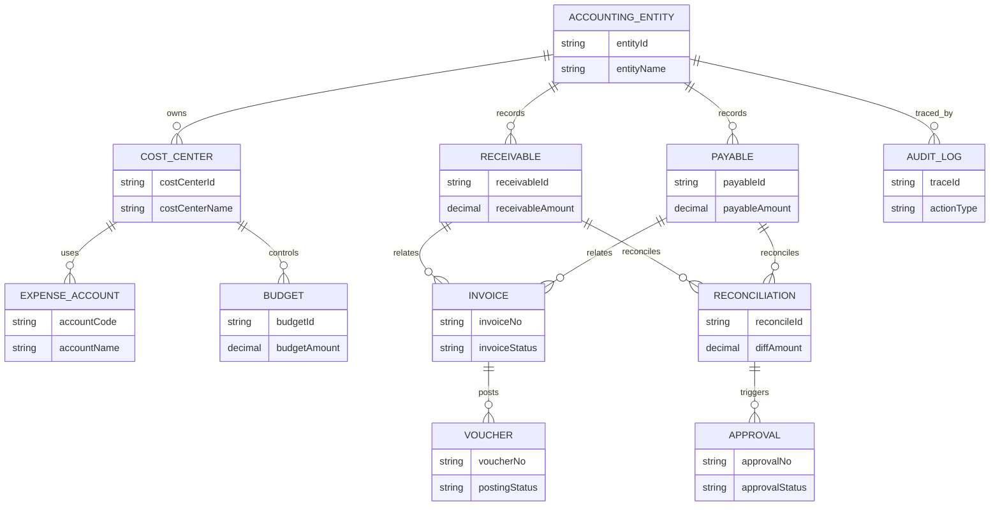
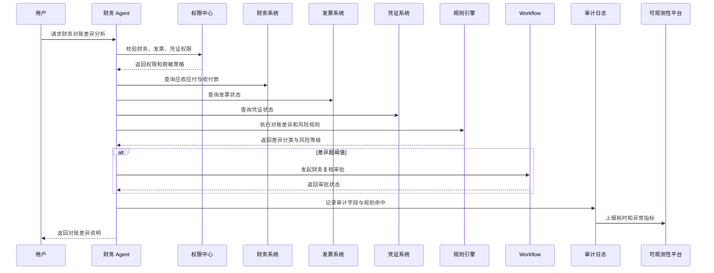

# 财务Agent总体方案

版本：v1.0  
更新时间：2026-06-29  
适用对象：企业软件工程师 / 架构师 / 技术负责人  

## 1. 本章核心结论

财务 Agent 应定位为财务数据查询、制度问答、预算分析、对账辅助和异常识别助手，而不是自动执行财务入账、付款或凭证修改的黑盒系统。

金额计算、预算口径、费用归集、应收应付状态、发票校验、审批条件和风险命中等确定性判断，必须优先由规则引擎、配置中心或财务业务系统处理。大模型主要负责语义理解、信息归纳、报表说明、文本生成和辅助分析。

涉及金额、发票、付款、凭证、预算调整、财务入账等高风险动作时，必须经过权限校验、人工确认或审批流程。Agent 输出的分析结论应标记数据来源、计算依据和规则命中情况。

## 2. 业务背景

财务部门面对大量重复查询、费用归集、应收应付确认、发票核对、预算执行跟踪、报表说明和异常费用排查工作。传统财务系统数据准确，但操作路径复杂，业务人员很难快速理解财务口径和异常原因。

财务 Agent 的价值在于把财务制度、业务单据、报表数据和对账链路以自然语言方式组织起来，帮助财务人员和业务人员更快定位问题、理解口径和准备材料。

## 3. 建设目标

1. 支持财务数据查询、费用归集、应收应付查询和发票信息查询。
2. 支持预算执行分析、财务报表辅助生成和财务制度问答。
3. 支持异常费用识别、财务对账辅助和差异原因归纳。
4. 建立财务数据权限、敏感字段脱敏、操作审计和高风险确认机制。
5. 将财务规则、金额口径、审批条件和风险识别从大模型中剥离，交给规则引擎或财务系统处理。

## 4. 典型使用场景

- 查询某部门本月费用归集情况。
- 查询客户应收余额、供应商应付状态和付款进度。
- 查询发票开具、认证、红冲、作废或关联订单情况。
- 分析预算执行率、超预算项目和费用趋势。
- 根据财务制度回答报销、付款、发票和预算相关问题。
- 辅助生成月度财务分析说明和报表摘要。
- 识别异常费用、重复报销、异常发票和对账差异。

## 5. 核心能力设计

- 财务问答：基于财务制度、费用政策、预算规则和操作手册提供问答。
- 数据查询：通过财务系统、ERP、预算系统、发票系统查询授权数据。
- 报表解释：对损益、费用、预算、应收、应付等报表进行口径说明和摘要生成。
- 异常识别：结合规则引擎识别金额异常、重复费用、预算超限和发票异常。
- 对账辅助：汇总订单、结算、发票、收付款和凭证之间的差异。
- 材料生成：辅助生成财务分析说明、对账说明和审批补充材料。

## 6. 数据来源与系统集成

典型数据来源包括财务系统、ERP、预算系统、报销系统、发票系统、资金系统、合同系统、订单系统和结算系统。

集成建议：

1. 财务主数据、科目、预算口径和核算规则由财务系统或主数据系统提供。
2. 订单、合同、结算和发票关联关系通过业务系统接口或数据中台提供。
3. 财务制度和操作手册进入 RAG 知识库，并保留版本和适用范围。
4. 财务凭证、付款状态、发票状态等实时数据通过业务服务查询，不直接依赖静态知识库。

## 7. Agent 工作流程

1. 用户提出财务查询或分析需求。
2. Agent 识别意图、业务对象、时间范围、组织范围和所需数据。
3. 权限中心校验用户是否具备对应财务数据访问权限。
4. 规则引擎判断数据范围、财务口径、风险等级和是否需要审批。
5. Agent 调用财务系统、预算系统、发票系统或 ERP 工具查询数据。
6. 大模型基于授权数据、规则结果和制度引用生成解释或分析摘要。
7. 涉及付款、入账、凭证修改、预算调整等动作时进入人工确认或审批。
8. 系统记录数据来源、规则命中、工具调用、输出结论和用户确认。

## 8. 规则引擎设计

规则引擎重点处理：

- 费用归集规则、预算控制规则、应收应付口径。
- 发票状态校验、重复报销识别、异常费用识别。
- 财务数据访问范围、敏感字段脱敏策略。
- 金额阈值、审批条件、付款风险等级。
- 对账差异分类和异常优先级。

大模型不能直接裁决金额是否正确、发票是否合规、预算是否可用或付款是否允许。它只能基于规则和系统返回结果进行解释和归纳。

## 9. 权限与安全设计

财务数据通常属于高敏数据，必须采用最小权限原则。

- 按组织、部门、角色、岗位、项目、成本中心和业务对象控制数据范围。
- 对金额、账户、发票、凭证、付款信息进行脱敏和分级展示。
- 财务报表导出、批量查询、敏感字段查看必须单独授权。
- Agent 调用财务工具前必须进行二次权限判断。
- 高风险动作必须经过用户确认、财务审批或业务系统原流程。

## 10. 性能与稳定性设计

- 多系统查询应拆分为并行查询和结果聚合，避免单接口阻塞。
- 应收应付、发票、凭证、费用明细等大数据查询必须支持分页、索引和过滤条件。
- 高频统计口径可使用缓存或预聚合，但敏感实时状态需实时校验。
- 对复杂规则执行设置性能预算，必要时采用预计算或异步分析。
- 对报表生成、批量对账和异常扫描使用消息队列异步执行。
- 对所有外部系统调用设置超时、重试、降级和幂等策略。
- 控制 RAG 片段数量和模型输出长度，降低 Token 成本。

## 11. 审计与可观测性

审计日志应记录用户身份、查询范围、数据来源、规则命中、工具调用、敏感字段访问、模型输出、确认动作和审批记录。

关键指标包括查询响应时间、财务工具成功率、异常识别准确率、对账差异处理时长、敏感数据访问次数、权限拒绝次数、Token 消耗和人工确认率。

## 12. 企业落地建议

建议先从只读查询、制度问答和报表解释切入，再逐步扩展到异常识别、对账辅助和审批材料生成。付款、入账、凭证修改等写操作应长期保持人工确认或审批控制。

## 13. 工程化设计补充

### 13.1 数据字段清单

- 基础字段：组织 ID、部门 ID、成本中心、项目编码、会计期间、币种、金额、税额。
- 应收应付：客户 ID、供应商 ID、应收单号、应付单号、账龄、到期日、付款状态。
- 发票信息：发票号、发票类型、开票日期、发票金额、税额、认证状态、红冲状态。
- 预算信息：预算科目、预算版本、预算金额、已用金额、冻结金额、可用余额。
- 凭证与账务：凭证号、科目编码、辅助核算、入账日期、制单人、审核状态。
- 审计字段：数据来源、规则版本、查询时间、操作人、traceId。

### 13.2 接口清单

- `finance.queryReceivable`：查询应收信息。
- `finance.queryPayable`：查询应付信息。
- `finance.queryInvoice`：查询发票信息。
- `finance.queryBudgetExecution`：查询预算执行情况。
- `finance.queryVoucher`：查询凭证和入账状态。
- `finance.detectExpenseException`：识别异常费用。
- `finance.reconcile`：执行对账辅助分析。

### 13.3 规则清单

- 费用归集规则、预算超限规则、发票状态规则。
- 应收应付账龄规则、付款风险规则、重复报销规则。
- 对账差异分类规则、敏感字段脱敏规则、导出权限规则。

### 13.4 权限矩阵

| 角色 | 查询 | 导出 | 异常识别 | 对账辅助 | 付款/入账 |
| --- | --- | --- | --- | --- | --- |
| 普通业务人员 | 本人或本部门授权数据 | 禁止或受限 | 只读 | 禁止 | 禁止 |
| 部门负责人 | 本部门及下级授权数据 | 受限 | 只读 | 受限 | 禁止 |
| 财务专员 | 授权组织和科目 | 受限 | 允许 | 允许 | 需审批 |
| 财务管理员 | 授权范围内全部 | 允许 | 允许 | 允许 | 需审批 |

### 13.5 异常场景

- 发票金额与订单或结算金额不一致。
- 预算余额不足或预算科目不匹配。
- 重复报销、重复付款或重复入账。
- 应收超期、应付异常、凭证缺失。
- 财务系统、发票系统或预算系统超时不可用。

### 13.6 审批与人工确认节点

- 付款、入账、凭证修改、预算调整必须人工确认或进入审批。
- 批量导出、批量对账、敏感字段查看需要二次确认。
- 异常费用处理建议只能作为辅助结论，由财务人员复核。

### 13.7 审计字段

记录用户 ID、角色、组织范围、查询对象、财务期间、接口名称、规则命中、敏感字段访问、脱敏策略、模型输出摘要、确认动作、审批单号和 traceId。

### 13.8 性能指标

- 普通查询 P95 响应时间。
- 报表摘要生成耗时。
- 对账任务完成时间。
- 财务接口成功率。
- 规则执行耗时。
- Token 平均消耗和峰值消耗。

### 13.9 缓存策略

- 财务科目、预算口径、费用类型、规则配置可缓存。
- 发票状态、付款状态、凭证状态在关键操作前必须实时查询。
- 报表摘要可按期间、组织和权限范围缓存。

### 13.10 降级策略

- 财务系统不可用时返回制度解释和待查询清单。
- 发票系统不可用时标记发票状态未知，不生成最终结论。
- 模型不可用时返回结构化数据和规则命中结果。
- 对账任务超时时转为异步任务并提供任务状态查询。

## 14. v1.1 样板深化初稿

以下内容为样板示例，需结合企业实际系统、财务口径、接口规范、权限体系和规则配置确认。

### 14.1 字段清单

| 字段名 | 字段中文名 | 来源系统 | 字段说明 | 是否敏感 | 是否脱敏 | 访问权限 | 审计要求 | 备注 |
| --- | --- | --- | --- | --- | --- | --- | --- | --- |
| accountingEntity | 会计主体 | 财务系统 | 核算主体或法人主体 | 是 | 否 | 财务数据权限 | 记录 | 示例 |
| costCenter | 成本中心 | 财务/主数据 | 费用归属成本中心 | 是 | 否 | 成本中心权限 | 记录 | 示例 |
| expenseAccount | 费用科目 | 财务系统 | 费用科目编码和名称 | 否 | 否 | 科目查看权限 | 记录 | 示例 |
| receivableAmount | 应收金额 | 财务系统 | 客户应收金额 | 是 | 视角色 | 应收权限 | 记录敏感访问 | 示例 |
| payableAmount | 应付金额 | 财务系统 | 供应商应付金额 | 是 | 视角色 | 应付权限 | 记录敏感访问 | 示例 |
| receivedAmount | 已收金额 | 财务系统 | 已到账金额 | 是 | 视角色 | 收款权限 | 记录 | 示例 |
| paidAmount | 已付金额 | 财务系统 | 已付款金额 | 是 | 视角色 | 付款权限 | 记录 | 示例 |
| unsettledAmount | 未结金额 | 财务系统 | 未收、未付或未结余额 | 是 | 视角色 | 财务权限 | 记录 | 示例 |
| invoiceNo | 发票号码 | 发票系统 | 发票唯一编号 | 是 | 是 | 发票权限 | 记录 | 示例 |
| voucherNo | 凭证号码 | 财务系统 | 财务凭证编号 | 是 | 是 | 凭证权限 | 记录 | 示例 |
| budgetAmount | 预算金额 | 预算系统 | 当前预算额度 | 是 | 视角色 | 预算权限 | 记录 | 示例 |
| usedBudget | 已用预算 | 预算系统 | 已占用或已执行预算 | 是 | 视角色 | 预算权限 | 记录 | 示例 |
| remainingBudget | 剩余预算 | 预算系统 | 可用预算余额 | 是 | 视角色 | 预算权限 | 记录 | 示例 |
| paymentTerm | 账期 | 财务/合同系统 | 应收应付账期 | 否 | 否 | 财务权限 | 记录 | 示例 |
| currency | 币种 | 财务系统 | 交易或记账币种 | 否 | 否 | 基础权限 | 记录 | 示例 |
| taxAmount | 税额 | 发票/财务系统 | 税额信息 | 是 | 视角色 | 发票权限 | 记录 | 示例 |
| createdBy | 创建人 | 财务系统 | 单据创建人 | 是 | 是 | 单据权限 | 记录 | 示例 |
| approvalStatus | 审批状态 | Workflow | 审批中、通过、驳回 | 否 | 否 | 审批权限 | 记录 | 示例 |
| postingStatus | 入账状态 | 财务系统 | 未入账、已入账、冲销 | 是 | 否 | 入账权限 | 记录 | 示例 |

### 14.2 接口清单

| 接口名称 | 接口用途 | 所属系统 | 调用方式 | 入参摘要 | 出参摘要 | 权限要求 | 是否高风险 | 失败处理 | 备注 |
| --- | --- | --- | --- | --- | --- | --- | --- | --- | --- |
| finance.queryReceivable | 应收查询接口 | 财务系统 | API/MCP | 客户、期间、组织 | 应收金额、账龄 | 应收权限 | 是 | 不输出财务结论 | 示例 |
| finance.queryPayable | 应付查询接口 | 财务系统 | API/MCP | 供应商、期间、组织 | 应付金额、付款状态 | 应付权限 | 是 | 返回待补查 | 示例 |
| finance.queryExpenseDetail | 费用明细查询接口 | 财务系统 | API/MCP | 科目、部门、期间 | 费用明细 | 费用权限 | 是 | 分页返回 | 示例 |
| budget.queryExecution | 预算执行查询接口 | 预算系统 | API | 预算科目、期间 | 预算、已用、剩余 | 预算权限 | 是 | 标记预算未知 | 示例 |
| invoice.query | 发票查询接口 | 发票系统 | API/MCP | 发票号、订单号 | 发票状态、税额 | 发票权限 | 是 | 标记发票未知 | 示例 |
| voucher.query | 凭证查询接口 | 财务系统 | API/MCP | 凭证号、单据号 | 凭证状态 | 凭证权限 | 是 | 标记凭证未知 | 示例 |
| reconcile.queryResult | 对账结果查询接口 | 对账系统 | API | 对账任务、期间 | 差异结果 | 对账权限 | 是 | 转异步 | 示例 |
| finance.generateReportDraft | 财务报表辅助生成接口 | 财务平台 | API | 报表类型、期间 | 报表摘要草稿 | 报表权限 | 否 | 返回结构化数据 | 示例 |
| workflow.queryApproval | 审批状态查询接口 | Workflow | API | 审批单号 | 审批状态 | 审批权限 | 否 | 提示稍后查询 | 示例 |
| audit.writeLog | 审计日志写入接口 | 审计平台 | API/消息 | traceId、动作 | 写入结果 | 系统权限 | 否 | 缓冲重试 | 示例 |

### 14.3 规则清单

| 规则编号 | 规则名称 | 适用环节 | 规则说明 | 规则来源 | 执行主体 | 命中后动作 | 是否需要人工确认 | 审计要求 | 备注 |
| --- | --- | --- | --- | --- | --- | --- | --- | --- | --- |
| FIN-RULE-001 | 金额展示权限规则 | 输出展示 | 不同角色展示不同金额粒度 | 权限中心 | 权限中心 | 脱敏或拒绝 | 否 | 记录权限结果 | 示例 |
| FIN-RULE-002 | 敏感字段脱敏规则 | 输出展示 | 发票号、凭证号、账号等脱敏 | 安全策略 | 规则引擎 | 脱敏展示 | 否 | 记录脱敏策略 | 示例 |
| FIN-RULE-003 | 预算超额规则 | 预算分析 | 已用预算超过阈值 | 预算系统 | 规则引擎 | 风险提示 | 是 | 记录阈值 | 示例 |
| FIN-RULE-004 | 发票缺失规则 | 发票校验 | 应开票但无发票记录 | 发票系统 | 规则引擎 | 标记异常 | 是 | 记录单据 | 示例 |
| FIN-RULE-005 | 凭证缺失规则 | 入账校验 | 应入账但无凭证 | 财务系统 | 规则引擎 | 转财务复核 | 是 | 记录状态 | 示例 |
| FIN-RULE-006 | 应收逾期规则 | 应收分析 | 超过账期未收款 | 财务系统 | 规则引擎 | 生成预警 | 否 | 记录账龄 | 示例 |
| FIN-RULE-007 | 应付异常规则 | 应付分析 | 异常提前付款或重复付款 | 财务系统 | 规则引擎 | 阻断建议 | 是 | 记录命中 | 示例 |
| FIN-RULE-008 | 费用科目异常规则 | 费用归集 | 科目与部门、项目不匹配 | 财务系统 | 规则引擎 | 标记异常 | 是 | 记录科目 | 示例 |
| FIN-RULE-009 | 对账差异规则 | 对账 | 差异金额或比例超阈值 | 对账系统 | 规则引擎 | 发起复核 | 是 | 记录差异 | 示例 |
| FIN-RULE-010 | 高风险导出审批规则 | 导出 | 大额或跨部门数据导出需审批 | 权限中心 | 规则引擎 | 创建审批 | 是 | 记录审批单 | 示例 |

### 14.4 权限矩阵

| 角色 | 查看费用 | 查看应收 | 查看应付 | 查看预算 | 查看发票 | 查看凭证 | 发起对账 | 导出财务数据 | 查看敏感金额 | 查看审计日志 |
| --- | --- | --- | --- | --- | --- | --- | --- | --- | --- | --- |
| 普通业务人员 | 本人/本部门 | 禁止 | 禁止 | 受限 | 禁止 | 禁止 | 申请 | 禁止 | 禁止 | 禁止 |
| 部门负责人 | 本部门 | 受限 | 受限 | 本部门 | 受限 | 禁止 | 申请 | 需审批 | 受限 | 禁止 |
| 财务专员 | 授权范围 | 允许 | 允许 | 允许 | 允许 | 受限 | 允许 | 需审批 | 允许 | 受限 |
| 财务经理 | 授权范围 | 允许 | 允许 | 允许 | 允许 | 允许 | 允许 | 需审批 | 允许 | 受限 |
| 审计人员 | 只读 | 只读 | 只读 | 只读 | 只读 | 只读 | 只读 | 需审批 | 只读 | 允许 |
| 系统管理员 | 配置 | 禁止业务数据 | 禁止业务数据 | 配置 | 禁止业务数据 | 禁止业务数据 | 配置 | 禁止 | 禁止 | 配置审计 |

### 14.5 异常场景

| 异常编号 | 异常名称 | 触发条件 | Agent 响应方式 | 是否降级 | 是否需要人工处理 | 审计要求 |
| --- | --- | --- | --- | --- | --- | --- |
| FIN-EX-001 | 权限不足 | 无财务数据权限 | 返回无权限提示 | 是 | 否 | 记录拒绝原因 |
| FIN-EX-002 | 预算超额 | 预算规则命中 | 提示超额并建议审批 | 否 | 是 | 记录规则 |
| FIN-EX-003 | 发票缺失 | 无发票记录 | 标记待补票 | 是 | 是 | 记录查询 |
| FIN-EX-004 | 凭证缺失 | 无凭证记录 | 不生成入账结论 | 是 | 是 | 记录状态 |
| FIN-EX-005 | 应收逾期 | 超过账期 | 生成逾期提醒 | 否 | 视情况 | 记录账龄 |
| FIN-EX-006 | 对账差异 | 差异超阈值 | 生成差异说明 | 否 | 是 | 记录差异 |
| FIN-EX-007 | 接口超时 | 财务接口超时 | 返回部分结果 | 是 | 视情况 | 记录超时 |
| FIN-EX-008 | 模型不可用 | LLM 调用失败 | 返回结构化数据 | 是 | 否 | 记录降级 |

### 14.6 审批与人工确认节点

以下动作不能由 Agent 自动完成，必须经过权限校验、人工确认或审批：修改金额、确认付款、发起退款、修改发票、修改凭证、财务入账、大额数据导出、跨部门查看敏感财务数据。

### 14.7 审计字段

审计字段示例：`traceId`、`requestId`、`userId`、`userName`、`departmentId`、`roleCode`、`agentCode`、`actionType`、`resourceType`、`resourceId`、`ruleId`、`permissionResult`、`riskLevel`、`inputSummary`、`outputSummary`、`confirmUser`、`approveUser`、`createdAt`。

### 14.8 性能指标

- 多系统查询 P95、财务接口成功率、规则执行耗时、对账任务完成时间、导出审批通过率、权限拒绝率、降级率、Token 平均消耗。
- 多系统查询需要分页、限流、超时控制；所有跨系统调用必须携带 traceId。

### 14.9 缓存策略

- 科目、币种、费用类型、预算口径、脱敏策略可缓存。
- 敏感财务金额、应收应付、发票、凭证状态必须控制缓存范围和过期时间，关键结论前实时校验。

### 14.10 降级策略

- 系统不可用时降级为只读查询、人工处理或稍后重试。
- 对账、报表生成等复杂任务超时后转异步处理。
- 大模型不可用时返回结构化规则结果，不生成自然语言结论。

### 14.11 测试用例

| 测试编号 | 测试场景 | 输入条件 | 预期结果 | 涉及系统 | 涉及规则 | 是否高风险 | 验收要点 |
| --- | --- | --- | --- | --- | --- | --- | --- |
| FIN-TC-001 | 财务制度问答 | 报销制度问题 | 返回制度引用 | RAG | 无 | 否 | 有引用 |
| FIN-TC-002 | 应收查询 | 授权客户 | 返回应收摘要 | 财务 | 001 | 是 | 权限正确 |
| FIN-TC-003 | 应付查询 | 授权供应商 | 返回应付摘要 | 财务 | 001 | 是 | 敏感脱敏 |
| FIN-TC-004 | 预算超额提示 | 已用超预算 | 返回超额预警 | 预算 | 003 | 是 | 规则命中 |
| FIN-TC-005 | 发票缺失识别 | 无发票 | 标记待补票 | 发票 | 004 | 否 | 不生成入账结论 |
| FIN-TC-006 | 凭证缺失识别 | 无凭证 | 转财务复核 | 财务 | 005 | 是 | 有审计 |
| FIN-TC-007 | 对账差异识别 | 差异超阈值 | 生成差异说明 | 对账 | 009 | 是 | 需确认 |
| FIN-TC-008 | 权限不足拦截 | 普通用户查凭证 | 拒绝访问 | 权限中心 | 001 | 是 | 无数据泄露 |

### 14.12 待确认事项

- 字段口径、接口名称、规则编号、权限矩阵均为示例，需结合企业实际系统确认。
- 预算阈值、对账差异阈值、导出审批条件和敏感字段范围需由财务、安全和审计团队确认。

## 15. 图示补充

### 15.1 财务 Agent 领域对象模型图

Mermaid 源文件：[财务Agent领域对象模型图.mmd](../../mermaid/16-财务Agent/财务Agent领域对象模型图.mmd)

### 15.2 财务对账差异分析时序图

Mermaid 源文件：[财务对账差异分析时序图.mmd](../../mermaid/16-财务Agent/财务对账差异分析时序图.mmd)

## 16. 后续待完善事项

1. 补充财务 Agent 权限矩阵。
2. 补充费用异常识别规则清单。
3. 补充应收应付与发票查询接口设计。
4. 补充财务对账流程图。
5. 补充财务审计日志字段规范。
