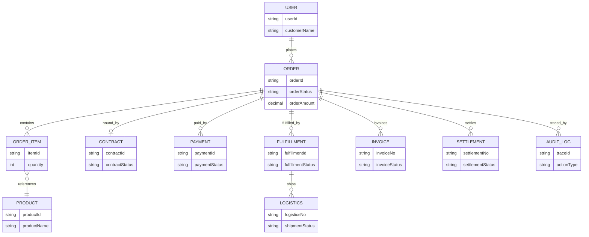
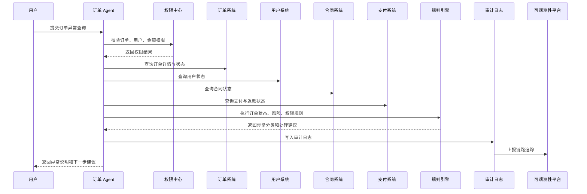
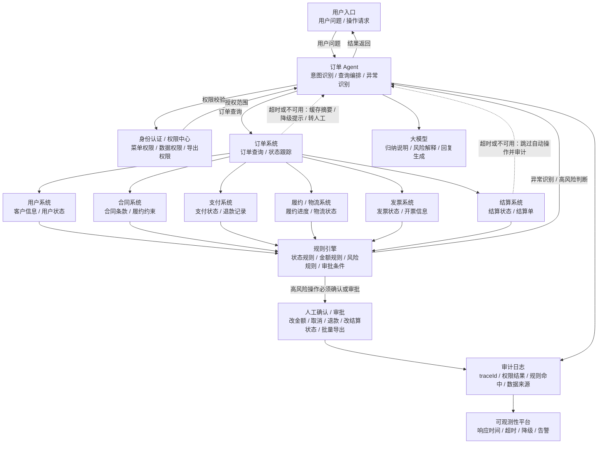

# 订单Agent总体方案

版本：v1.0  
更新时间：2026-06-29  
适用对象：企业软件工程师 / 架构师 / 技术负责人  

## 1. 本章核心结论

订单 Agent 应围绕订单查询、状态跟踪、异常识别、履约分析和变更辅助构建，帮助业务人员快速理解订单全链路状态。

订单状态流转、取消、变更、退款、履约规则、库存占用、合同约束、发票关联和风险命中等确定性判断，必须由规则引擎、配置中心或订单业务系统处理。大模型主要负责语义理解、信息归纳、异常说明和辅助分析。

## 2. 业务背景

订单通常连接用户、商品、库存、物流、合同、发票、结算和财务。订单数据量大、状态复杂、异常多，业务人员需要在多个系统中反复查询才能判断订单进展和问题原因。

订单 Agent 的目标是把订单状态、履约进度、异常原因和关联业务对象整合为可追溯的业务视图。

## 3. 建设目标

1. 支持订单查询、订单状态跟踪和订单履约进度分析。
2. 支持订单异常识别、风险提示和原因归纳。
3. 辅助订单取消、变更、退款等操作的材料准备和规则校验。
4. 关联库存、物流、合同、发票、结算和财务信息。
5. 确保高风险订单操作经过规则校验、权限判断和人工确认。

## 4. 典型使用场景

- 查询订单当前状态、履约节点和预计完成时间。
- 分析订单未发货、未签收、未开票、未结算等异常原因。
- 查询订单与库存、物流、合同、发票和结算的关联情况。
- 辅助处理订单取消、变更、退款和补发。
- 识别高风险订单，例如异常金额、异常地址、频繁退款、库存不足。
- 为客服、销售、运营和财务生成订单说明。

## 5. 核心能力设计

- 订单识别：通过订单号、用户、合同、发票、物流单等定位订单。
- 状态跟踪：展示订单创建、支付、审核、出库、物流、签收、结算、开票等节点。
- 异常识别：识别超时、库存不足、物流异常、发票异常、退款异常。
- 关联查询：关联库存、物流、合同、发票、结算、财务和用户工单。
- 操作辅助：为取消、变更、退款生成校验结果、说明和审批材料。
- 风险提示：基于规则命中结果提示订单风险。

## 6. 数据来源与系统集成

典型数据来源包括订单系统、库存系统、物流系统、合同系统、发票系统、支付系统、结算系统、财务系统、客服工单系统和用户系统。

集成建议：

1. 订单主状态由订单系统提供。
2. 履约进度由库存、仓储、物流或服务交付系统提供。
3. 发票、结算、财务状态由对应系统实时查询。
4. 订单规则、取消规则、退款规则由规则引擎或订单系统提供。
5. 订单相关知识和流程说明进入 RAG 知识库。

## 7. Agent 工作流程

1. 用户输入订单号、用户信息或订单问题。
2. Agent 识别订单对象和查询意图。
3. 权限中心判断用户是否可访问该订单及关联数据。
4. 订单系统返回订单基础状态和可见字段。
5. 规则引擎判断订单状态、异常类型、风险命中和可操作范围。
6. Agent 查询库存、物流、合同、发票、结算等关联信息。
7. 大模型归纳订单状态、异常原因、处理建议和所需材料。
8. 涉及取消、变更、退款等高风险操作时进入人工确认或审批。

## 8. 规则引擎设计

规则引擎重点处理：

- 订单状态流转规则。
- 取消、变更、退款条件。
- 履约超时、库存不足、物流异常判断。
- 订单金额、地址、频次、用户风险等风控规则。
- 订单与合同、发票、结算的匹配规则。
- 高风险操作是否需要审批。

大模型不能直接决定订单是否可以退款、取消或变更，必须以规则和订单系统返回结果为准。

## 9. 权限与安全设计

- 订单数据访问按组织、部门、客户归属、销售归属、项目、角色和人员范围控制。
- 订单金额、发票、支付、收货地址和用户隐私字段需要脱敏或分级展示。
- 取消、变更、退款、补发、开票等操作必须校验功能权限和数据权限。
- 批量订单查询、导出和状态修改必须单独授权。
- Agent 输出应标明数据来源、订单状态时间和规则命中情况。

## 10. 性能与稳定性设计

- 订单数据量较大，查询必须支持分页、索引、时间范围和状态过滤。
- 订单状态、物流状态和履约节点可缓存短时间结果，但关键操作前必须实时校验。
- 多系统查询应并行化并设置超时，部分系统失败时返回可解释的部分结果。
- 复杂订单异常分析可异步执行。
- 取消、退款、变更操作必须具备幂等设计，避免重复提交。
- 高频订单查询应使用缓存和限流策略。
- 控制模型上下文，只注入关键订单状态和关联摘要，降低 Token 成本。

## 11. 审计与可观测性

审计日志应记录订单号、用户身份、查询范围、关联系统、规则命中、工具调用、敏感字段访问、操作确认和审批结果。

关键指标包括订单查询延迟、关联系统成功率、异常识别准确率、退款辅助转化率、超时率、降级率、幂等拦截次数和 Token 消耗。

## 12. 企业落地建议

建议先从只读订单查询和状态解释切入，再扩展到异常识别和操作辅助。取消、变更、退款等写操作必须通过业务系统原有流程或 Workflow 执行。

## 13. 工程化设计补充

### 13.1 数据字段清单

- 订单基础：订单号、订单类型、用户 ID、客户 ID、订单状态、创建时间、更新时间。
- 金额字段：订单金额、优惠金额、实付金额、退款金额、税额、币种。
- 履约字段：库存状态、出库状态、物流单号、签收状态、履约节点。
- 关联字段：合同号、发票号、结算单号、支付单号、工单号。
- 风险字段：异常标签、风险等级、规则命中、处理建议。

### 13.2 接口清单

- `order.queryDetail`：查询订单详情。
- `order.queryStatusTimeline`：查询订单状态时间线。
- `order.queryFulfillment`：查询履约进度。
- `order.queryRelatedObjects`：查询合同、发票、结算和工单关联。
- `order.checkOperationAllowed`：校验取消、变更、退款是否允许。
- `order.createChangeRequest`：创建订单变更申请。

### 13.3 规则清单

- 订单状态流转规则、退款条件规则、取消条件规则。
- 履约超时规则、库存不足规则、物流异常规则。
- 发票开具限制、结算状态限制、合同约束规则。
- 高风险订单识别规则和人工确认触发规则。

### 13.4 权限矩阵

| 角色 | 查询订单 | 查看金额 | 退款辅助 | 变更辅助 | 批量导出 |
| --- | --- | --- | --- | --- | --- |
| 客服 | 授权客户订单 | 脱敏或受限 | 可发起申请 | 可发起申请 | 禁止 |
| 销售 | 归属客户订单 | 允许 | 可发起申请 | 可发起申请 | 受限 |
| 运营 | 授权业务线订单 | 允许 | 需审批 | 需审批 | 受限 |
| 管理员 | 授权范围内全部 | 允许 | 需审批 | 需审批 | 允许 |

### 13.5 异常场景

- 订单状态与履约状态不一致。
- 库存已扣减但未出库。
- 已签收但未结算或未开票。
- 退款金额超过可退金额。
- 订单系统、物流系统或库存系统超时。

### 13.6 审批与人工确认节点

- 订单取消、变更、退款、补发、改地址必须人工确认。
- 涉及金额、合同、发票和结算状态的操作需要规则校验。
- 高风险订单处理建议必须由业务负责人复核。

### 13.7 审计字段

记录用户 ID、订单号、操作类型、订单状态、规则命中、关联对象、敏感字段访问、工具调用、确认动作、审批单号和 traceId。

### 13.8 性能指标

- 订单详情查询 P95。
- 状态时间线查询耗时。
- 多系统关联查询成功率。
- 订单异常识别耗时。
- 退款校验规则执行耗时。
- Token 平均消耗。

### 13.9 缓存策略

- 订单状态摘要可短时缓存。
- 订单规则、状态字典、履约节点字典可缓存。
- 退款、取消、变更提交前必须实时校验订单状态和金额。

### 13.10 降级策略

- 物流系统不可用时返回订单主状态并标记物流未知。
- 结算系统不可用时不生成最终结算判断。
- 模型不可用时返回结构化订单状态和规则校验结果。
- 多系统关联查询超时时返回部分结果和待补查系统清单。

## 14. v1.1 样板深化初稿

以下内容为样板示例，需结合企业实际订单系统、履约系统、合同系统、支付系统、权限体系和规则配置确认。

### 14.1 字段清单

| 字段名 | 字段中文名 | 来源系统 | 字段说明 | 是否敏感 | 是否脱敏 | 访问权限 | 审计要求 | 备注 |
| --- | --- | --- | --- | --- | --- | --- | --- | --- |
| orderId | 订单号 | 订单系统 | 订单唯一编号 | 否 | 否 | 订单查看权限 | 记录 | 示例 |
| userId | 用户编号 | 用户系统 | 下单用户或客户编号 | 是 | 是 | 用户查看权限 | 记录 | 示例 |
| customerName | 客户名称 | 用户/CRM | 客户或会员名称 | 是 | 视角色 | 客户权限 | 记录 | 示例 |
| orderType | 订单类型 | 订单系统 | 销售、服务、采购、续费等 | 否 | 否 | 订单权限 | 记录 | 示例 |
| orderSource | 订单来源 | 订单系统 | 线上、线下、渠道、人工录入等 | 否 | 否 | 订单权限 | 记录 | 示例 |
| orderStatus | 订单状态 | 订单系统 | 创建、已支付、履约中、完成、取消等 | 否 | 否 | 订单权限 | 记录 | 示例 |
| fulfillmentStatus | 履约状态 | 履约系统 | 待履约、履约中、已完成、异常 | 否 | 否 | 履约权限 | 记录 | 示例 |
| paymentStatus | 支付状态 | 支付系统 | 未支付、部分支付、已支付、退款中 | 是 | 视角色 | 支付权限 | 记录敏感访问 | 示例 |
| shipmentStatus | 发货状态 | 仓储/物流 | 待发货、已发货、异常 | 否 | 否 | 履约权限 | 记录 | 示例 |
| receiptStatus | 收货状态 | 物流/履约 | 未收货、已签收、拒收 | 否 | 否 | 履约权限 | 记录 | 示例 |
| invoiceStatus | 开票状态 | 发票系统 | 未开票、已开票、红冲、作废 | 是 | 视角色 | 发票权限 | 记录 | 示例 |
| settlementStatus | 结算状态 | 结算系统 | 未结算、部分结算、已结算、异常 | 是 | 视角色 | 结算权限 | 记录 | 示例 |
| contractId | 合同编号 | 合同系统 | 关联合同编号 | 是 | 是 | 合同权限 | 记录 | 示例 |
| orderItems | 商品明细 | 订单系统 | 商品、数量、单价、折扣等 | 是 | 视角色 | 明细权限 | 记录 | 示例 |
| orderAmount | 订单金额 | 订单系统 | 订单原始金额 | 是 | 视角色 | 金额权限 | 记录 | 示例 |
| discountAmount | 优惠金额 | 订单系统 | 优惠或折扣金额 | 是 | 视角色 | 金额权限 | 记录 | 示例 |
| payableAmount | 应付金额 | 订单/支付系统 | 用户应支付金额 | 是 | 视角色 | 金额权限 | 记录 | 示例 |
| paidAmount | 已付金额 | 支付系统 | 实际支付金额 | 是 | 视角色 | 支付权限 | 记录 | 示例 |
| refundAmount | 退款金额 | 支付系统 | 已退或待退金额 | 是 | 视角色 | 退款权限 | 记录 | 示例 |
| orderTime | 下单时间 | 订单系统 | 订单创建时间 | 否 | 否 | 订单权限 | 记录 | 示例 |
| paymentTime | 支付时间 | 支付系统 | 支付完成时间 | 是 | 视角色 | 支付权限 | 记录 | 示例 |
| fulfillmentCompletedAt | 履约完成时间 | 履约系统 | 履约完成时间 | 否 | 否 | 履约权限 | 记录 | 示例 |
| createdBy | 创建人 | 订单系统 | 订单创建人或系统 | 是 | 是 | 订单权限 | 记录 | 示例 |
| departmentId | 所属部门 | 组织系统 | 订单归属部门 | 是 | 否 | 数据权限 | 记录 | 示例 |
| riskLevel | 风险等级 | 风控/规则引擎 | 低、中、高风险 | 是 | 否 | 风险权限 | 记录规则 | 示例 |

### 14.2 接口清单

| 接口名称 | 接口用途 | 所属系统 | 调用方式 | 入参摘要 | 出参摘要 | 权限要求 | 是否高风险 | 失败处理 | 备注 |
| --- | --- | --- | --- | --- | --- | --- | --- | --- | --- |
| order.queryList | 订单查询接口 | 订单系统 | API/MCP | 用户、时间、状态、分页 | 订单列表 | 订单列表权限 | 否 | 返回空列表或提示重试 | 示例 |
| order.queryDetail | 订单详情查询接口 | 订单系统 | API/MCP | orderId | 订单详情 | 订单详情权限 | 是 | 返回部分信息 | 示例 |
| order.queryStatus | 订单状态查询接口 | 订单系统 | API/MCP | orderId | 订单状态时间线 | 订单权限 | 否 | 标记状态未知 | 示例 |
| fulfillment.queryStatus | 订单履约状态查询接口 | 履约系统 | API/MCP | orderId | 履约节点 | 履约权限 | 否 | 标记履约未知 | 示例 |
| payment.queryStatus | 支付状态查询接口 | 支付系统 | API/MCP | orderId/paymentId | 支付状态 | 支付权限 | 是 | 不生成退款判断 | 示例 |
| shipment.queryStatus | 发货状态查询接口 | 物流系统 | API/MCP | orderId | 发货/物流状态 | 履约权限 | 否 | 标记物流未知 | 示例 |
| invoice.queryStatus | 开票状态查询接口 | 发票系统 | API/MCP | orderId/invoiceId | 发票状态 | 发票权限 | 是 | 标记发票未知 | 示例 |
| settlement.queryStatus | 结算状态查询接口 | 结算系统 | API/MCP | orderId | 结算状态 | 结算权限 | 是 | 不生成结算结论 | 示例 |
| contract.queryRelated | 合同关联查询接口 | 合同系统 | API/MCP | contractId/orderId | 合同摘要 | 合同权限 | 是 | 标记合同待查 | 示例 |
| user.queryRelated | 用户关联查询接口 | 用户系统 | API/MCP | userId/customerId | 用户摘要 | 用户权限 | 是 | 返回脱敏摘要 | 示例 |
| order.queryException | 订单异常查询接口 | 订单系统 | API/MCP | orderId | 异常标签 | 异常查看权限 | 否 | 返回待分析 | 示例 |
| order.queryRisk | 订单风险查询接口 | 风控系统 | API/MCP | orderId/userId | 风险等级 | 风险权限 | 是 | 转人工复核 | 示例 |
| audit.writeLog | 审计日志写入接口 | 审计平台 | API/消息 | traceId/action | 写入结果 | 系统权限 | 否 | 缓冲重试 | 示例 |

### 14.3 规则清单

| 规则编号 | 规则名称 | 适用环节 | 规则说明 | 规则来源 | 执行主体 | 命中后动作 | 是否需要人工确认 | 审计要求 | 备注 |
| --- | --- | --- | --- | --- | --- | --- | --- | --- | --- |
| ORDER-RULE-001 | 订单状态准入规则 | 状态判断 | 取消、关闭、退货中订单限制后续操作 | 订单系统 | 规则引擎 | 阻断或转人工 | 是 | 记录订单状态 | 示例 |
| ORDER-RULE-002 | 用户状态校验规则 | 用户关联 | 冻结、注销、黑名单用户限制操作 | 用户系统 | 规则引擎 | 阻断高风险动作 | 是 | 记录用户状态 | 示例 |
| ORDER-RULE-003 | 合同状态校验规则 | 合同关联 | 合同过期、冻结、无效时限制订单处理 | 合同系统 | 规则引擎 | 转人工复核 | 是 | 记录合同状态 | 示例 |
| ORDER-RULE-004 | 支付状态校验规则 | 支付判断 | 未支付、支付中、退款中限制结算或退款 | 支付系统 | 规则引擎 | 标记待处理 | 是 | 记录支付状态 | 示例 |
| ORDER-RULE-005 | 履约状态校验规则 | 履约判断 | 未履约完成不得确认结算 | 履约系统 | 规则引擎 | 阻断结算建议 | 否 | 记录履约节点 | 示例 |
| ORDER-RULE-006 | 开票状态校验规则 | 发票关联 | 发票红冲、作废、缺失时标记异常 | 发票系统 | 规则引擎 | 转人工 | 是 | 记录发票状态 | 示例 |
| ORDER-RULE-007 | 结算状态校验规则 | 结算关联 | 已结算订单限制退款和金额调整 | 结算系统 | 规则引擎 | 触发审批 | 是 | 记录结算状态 | 示例 |
| ORDER-RULE-008 | 退款风险校验规则 | 退款辅助 | 退款金额、频次、用户风险命中 | 风控系统 | 规则引擎 | 发起审批 | 是 | 记录风险项 | 示例 |
| ORDER-RULE-009 | 订单金额异常规则 | 金额校验 | 订单金额、优惠、应付、已付不一致 | 订单/支付系统 | 规则引擎 | 标记异常 | 是 | 记录差异 | 示例 |
| ORDER-RULE-010 | 高频订单风险规则 | 风控 | 短时间多笔订单或异常频率 | 风控系统 | 规则引擎 | 风险提示 | 是 | 记录频次 | 示例 |
| ORDER-RULE-011 | 跨部门订单查看权限规则 | 权限 | 跨部门查看敏感订单需授权 | 权限中心 | 权限中心 | 拒绝或脱敏 | 否 | 记录权限结果 | 示例 |
| ORDER-RULE-012 | 高风险订单操作审批规则 | 操作控制 | 修改金额、退款、状态变更需审批 | Workflow | 规则引擎 | 创建审批 | 是 | 记录审批单 | 示例 |

### 14.4 权限矩阵

| 角色 | 查看订单列表 | 查看订单详情 | 查看订单金额 | 查看用户信息 | 查看合同信息 | 查看支付状态 | 查看履约状态 | 查看开票状态 | 查看结算状态 | 发起订单异常分析 | 发起退款辅助判断 | 导出订单数据 | 查看审计日志 |
| --- | --- | --- | --- | --- | --- | --- | --- | --- | --- | --- | --- | --- | --- |
| 客服人员 | 授权范围 | 授权范围 | 脱敏 | 脱敏 | 禁止 | 受限 | 允许 | 禁止 | 摘要 | 申请 | 申请 | 禁止 | 禁止 |
| 业务运营人员 | 授权业务线 | 授权业务线 | 受限 | 脱敏 | 受限 | 受限 | 允许 | 受限 | 受限 | 允许 | 申请 | 需审批 | 禁止 |
| 订单专员 | 授权范围 | 允许 | 允许 | 授权 | 受限 | 允许 | 允许 | 受限 | 受限 | 允许 | 申请 | 需审批 | 受限 |
| 部门负责人 | 本部门及下级 | 允许 | 受限 | 脱敏 | 受限 | 受限 | 允许 | 受限 | 受限 | 允许 | 申请 | 需审批 | 禁止 |
| 财务人员 | 授权范围 | 允许 | 允许 | 受限 | 受限 | 允许 | 摘要 | 允许 | 允许 | 允许 | 受限 | 需审批 | 受限 |
| 结算人员 | 授权范围 | 允许 | 允许 | 受限 | 允许 | 受限 | 摘要 | 受限 | 允许 | 允许 | 禁止 | 需审批 | 受限 |
| 审计人员 | 只读 | 只读 | 只读 | 脱敏 | 只读 | 只读 | 只读 | 只读 | 只读 | 只读 | 禁止 | 需审批 | 允许 |
| 系统管理员 | 配置权限 | 禁止业务数据 | 禁止业务数据 | 禁止业务数据 | 禁止业务数据 | 禁止业务数据 | 配置 | 禁止业务数据 | 禁止业务数据 | 配置 | 禁止 | 禁止 | 配置审计 |

### 14.5 异常场景

| 异常编号 | 异常名称 | 触发条件 | Agent 响应方式 | 是否降级 | 是否需要人工处理 | 审计要求 |
| --- | --- | --- | --- | --- | --- | --- |
| ORDER-EX-001 | 订单不存在 | 订单系统无记录 | 提示核对订单号 | 是 | 是 | 记录订单号 |
| ORDER-EX-002 | 用户不存在 | 用户系统无记录 | 返回无法识别用户 | 是 | 是 | 记录输入摘要 |
| ORDER-EX-003 | 用户状态异常 | 用户冻结、注销、黑名单 | 阻断高风险操作 | 否 | 是 | 记录用户状态 |
| ORDER-EX-004 | 合同状态异常 | 合同过期、冻结、无效 | 转人工复核 | 否 | 是 | 记录合同状态 |
| ORDER-EX-005 | 订单状态不允许操作 | 取消、关闭、退货中 | 阻断操作建议 | 否 | 视情况 | 记录规则 |
| ORDER-EX-006 | 支付状态异常 | 未支付、退款中、支付失败 | 不生成退款结论 | 是 | 是 | 记录支付状态 |
| ORDER-EX-007 | 履约状态异常 | 未履约或履约异常 | 标记履约待处理 | 是 | 是 | 记录履约节点 |
| ORDER-EX-008 | 发货状态异常 | 物流异常或未发货 | 返回物流未知或异常 | 是 | 视情况 | 记录物流状态 |
| ORDER-EX-009 | 开票状态异常 | 发票缺失、红冲、作废 | 不生成开票完成结论 | 是 | 是 | 记录发票状态 |
| ORDER-EX-010 | 结算状态异常 | 结算失败、重复、状态冲突 | 转结算复核 | 是 | 是 | 记录结算状态 |
| ORDER-EX-011 | 订单金额异常 | 应付、已付、退款金额不一致 | 生成差异提示 | 否 | 是 | 记录金额差异 |
| ORDER-EX-012 | 重复订单风险 | 短时间重复下单或重复订单号 | 风险提示 | 否 | 是 | 记录风险项 |
| ORDER-EX-013 | 退款风险 | 退款金额、频次或状态异常 | 触发审批 | 否 | 是 | 记录退款规则 |
| ORDER-EX-014 | 权限不足 | 权限中心拒绝 | 返回无权限提示 | 是 | 否 | 记录拒绝原因 |
| ORDER-EX-015 | 接口超时 | 下游系统超时 | 返回部分结果 | 是 | 视情况 | 记录超时系统 |
| ORDER-EX-016 | 下游系统不可用 | 系统熔断或故障 | 降级为只读或稍后重试 | 是 | 是 | 记录降级策略 |

### 14.6 审批与人工确认节点

以下动作不能由 Agent 自动完成，必须经过权限校验、人工确认或审批：修改订单金额、取消订单、修改订单状态、发起退款、修改合同关联、修改开票信息、修改结算状态、大批量导出订单数据、跨部门查看敏感订单数据。

### 14.7 审计字段

审计字段示例：`traceId`、`requestId`、`userId`、`userName`、`departmentId`、`roleCode`、`agentCode`、`actionType`、`resourceType`、`resourceId`、`orderId`、`customerId`、`contractId`、`ruleId`、`permissionResult`、`riskLevel`、`inputSummary`、`outputSummary`、`confirmUser`、`approveUser`、`createdAt`。

### 14.8 性能指标

- 订单列表查询 P95、订单详情查询 P95、订单状态查询耗时、多系统聚合耗时、规则执行耗时、异常分析任务耗时、接口超时率、降级率、Token 平均消耗。
- 订单查询需要分页、限流、超时控制；所有跨系统调用必须携带 traceId。

### 14.9 缓存策略

- 高频订单查询可以缓存基础状态、订单状态字典、履约节点字典和规则配置。
- 金额、支付、退款、结算、开票等敏感状态必须控制缓存范围和过期时间，最终结论前实时校验。

### 14.10 降级策略

- 下游系统不可用时降级为只读查询、人工处理或稍后重试。
- 大批量订单分析建议异步执行。
- 高风险操作需要幂等控制，避免重复取消、重复退款或重复状态变更。
- 大模型不可用时返回结构化订单状态和规则命中结果。

### 14.11 测试用例

| 测试编号 | 测试场景 | 输入条件 | 预期结果 | 涉及系统 | 涉及规则 | 是否高风险 | 验收要点 |
| --- | --- | --- | --- | --- | --- | --- | --- |
| ORDER-TC-001 | 订单查询 | 有效用户和时间范围 | 返回分页订单列表 | 订单系统 | 权限策略 | 否 | 分页正确 |
| ORDER-TC-002 | 订单详情查询 | 有效订单号 | 返回订单详情 | 订单系统 | 011 | 是 | 敏感字段受控 |
| ORDER-TC-003 | 订单状态解释 | 已完成订单 | 返回状态时间线解释 | 订单系统 | 001 | 否 | 状态来源明确 |
| ORDER-TC-004 | 履约状态判断 | 履约中订单 | 返回履约节点和提示 | 履约系统 | 005 | 否 | 不误判完成 |
| ORDER-TC-005 | 支付状态异常识别 | 支付失败订单 | 返回支付异常说明 | 支付系统 | 004 | 是 | 不触发退款 |
| ORDER-TC-006 | 开票状态异常识别 | 发票作废 | 标记开票异常 | 发票系统 | 006 | 是 | 需人工处理 |
| ORDER-TC-007 | 结算状态识别 | 已结算订单 | 返回结算状态并限制退款 | 结算系统 | 007 | 是 | 规则命中 |
| ORDER-TC-008 | 退款风险提示 | 高频退款用户 | 触发退款风险提示 | 风控系统 | 008/010 | 是 | 审批入口明确 |
| ORDER-TC-009 | 权限不足拦截 | 跨部门订单 | 返回无权限或脱敏 | 权限中心 | 011 | 是 | 无数据泄露 |
| ORDER-TC-010 | 接口超时降级 | 物流系统超时 | 返回部分结果并记录降级 | 物流系统 | 降级策略 | 否 | traceId 完整 |

### 14.12 待确认事项

- 字段口径、接口名称、规则编号、权限矩阵均为示例，需结合企业实际系统确认。
- 退款风险阈值、跨部门查看策略、大批量导出条件和幂等键设计需由业务、财务、安全和审计团队共同确认。

## 15. 图示补充

### 15.1 订单 Agent 领域对象模型图

Mermaid 源文件：[订单Agent领域对象模型图.mmd](../../mermaid/18-订单Agent/订单Agent领域对象模型图.mmd)

### 15.2 订单异常识别与处理建议时序图

Mermaid 源文件：[订单异常识别与处理建议时序图.mmd](../../mermaid/18-订单Agent/订单异常识别与处理建议时序图.mmd)

## 16. 后续待完善事项

1. 补充订单状态机。
2. 补充订单异常规则清单。
3. 补充订单关联对象模型。
4. 补充退款、取消、变更审批流程。
5. 补充订单审计日志字段规范。
## 订单 Agent 数据流图

Mermaid 源文件：[订单Agent数据流图.mmd](../../mermaid/18-订单Agent/订单Agent数据流图.mmd)

### 订单数据流说明

订单 Agent 数据流需要覆盖用户请求、意图识别、权限校验、订单查询、关联数据聚合、规则判断、异常识别、大模型归纳、人工确认、审计留痕和结果返回。订单 Agent 不能直接绕过业务系统修改订单，也不能把金额、支付、退款、结算状态等敏感判断交给大模型自行决定。

### 用户请求到订单数据查询的链路

用户通过工作台、企业 IM 或业务系统入口提交订单问题后，订单 Agent 先进行意图识别，再调用权限中心确认用户是否具备订单查看、敏感字段查看、导出和操作权限。通过权限校验后，订单 Agent 查询订单系统，并按需关联用户、合同、支付、履约、发票和结算数据。

### 订单关联数据范围

订单数据通常需要与用户系统、合同系统、支付系统、履约或物流系统、发票系统和结算系统联动。不同系统返回的数据需要保留来源标识、更新时间和权限过滤结果，避免在多系统聚合后丢失审计依据。

### 权限、规则、审计和异常处理

修改订单金额、取消订单、发起退款、修改结算状态、大批量导出订单数据等高风险动作必须进入人工确认或审批流程。金额、支付、退款和结算状态等敏感数据必须记录权限结果、规则命中和数据来源。下游系统超时或不可用时，订单 Agent 应返回降级提示、缓存摘要或转人工处理，不能继续执行自动写操作。

