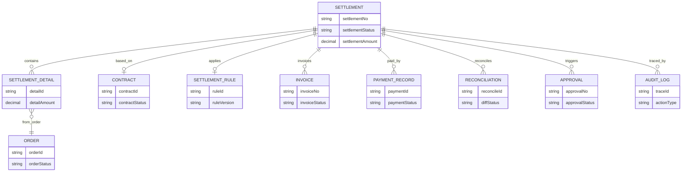
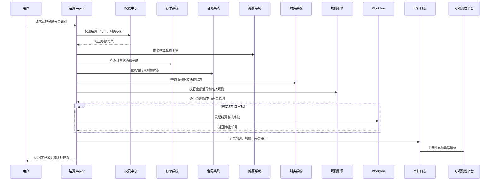
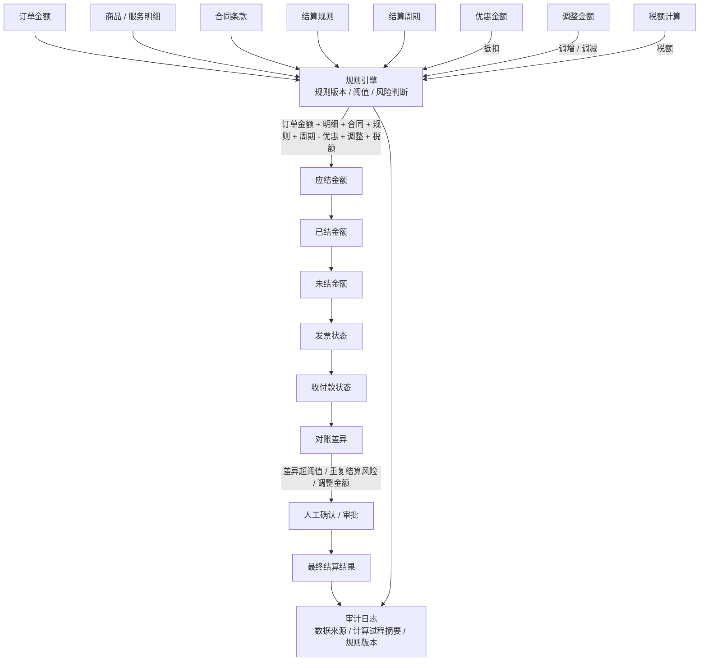

# 结算Agent总体方案

版本：v1.0  
更新时间：2026-06-29  
适用对象：企业软件工程师 / 架构师 / 技术负责人  

## 1. 本章核心结论

结算 Agent 应用于结算单查询、结算规则解释、金额计算辅助、差异识别、状态跟踪和异常预警。结算结果必须可追溯、可审计、可复核。

结算金额计算、结算规则匹配、周期判断、差异归因、合同约束、发票匹配和财务确认等确定性逻辑，必须由规则引擎、配置中心或结算业务系统处理。大模型负责语义理解、结果说明、差异归纳和辅助分析。

## 2. 业务背景

结算位于订单、合同、发票、收付款和财务凭证之间，是企业经营闭环中的关键环节。结算规则复杂、周期多样、金额计算敏感，结算差异往往需要跨订单、合同、发票和财务系统排查。

结算 Agent 的价值是帮助业务、财务和结算人员快速理解结算状态、规则依据、差异原因和处理路径。

## 3. 建设目标

1. 支持结算单查询、结算状态跟踪和结算周期管理。
2. 支持结算规则解释、结算金额计算辅助和差异识别。
3. 支持结算异常预警和跨系统关联分析。
4. 关联订单、合同、发票、收付款和财务凭证。
5. 确保结算结果可追溯、可审计、可复核。

## 4. 典型使用场景

- 查询某客户、供应商、订单或合同的结算单。
- 解释某笔结算金额的计算依据。
- 分析结算差异，例如订单金额、合同规则、发票金额和付款金额不一致。
- 跟踪结算周期和结算状态。
- 识别超期未结算、异常扣款、重复结算和金额异常。
- 生成结算说明、差异说明和审批材料。

## 5. 核心能力设计

- 结算单查询：按客户、供应商、订单、合同、周期和状态查询。
- 规则解释：解释结算周期、计费项、扣减项、税率、账期和口径。
- 金额辅助：调用规则引擎或结算系统计算应结金额、差异和调整项。
- 差异识别：识别订单、合同、发票、收付款和凭证之间的不一致。
- 状态跟踪：跟踪待结算、已结算、待开票、待付款、已入账等状态。
- 异常预警：识别超期、重复、金额异常、规则不匹配和凭证缺失。

## 6. 数据来源与系统集成

典型数据来源包括结算系统、订单系统、合同系统、发票系统、支付或资金系统、财务系统、ERP 和数据仓库。

集成建议：

1. 结算单和结算状态由结算系统提供。
2. 结算规则由规则引擎、配置中心或结算系统提供。
3. 订单、合同、发票、收付款和凭证通过业务系统实时查询。
4. 结算制度和操作说明进入 RAG 知识库。
5. 结算差异分析需要保留每个数据来源和更新时间。

## 7. Agent 工作流程

1. 用户提出结算查询、差异分析或规则解释需求。
2. Agent 识别结算对象、周期、客户或供应商范围。
3. 权限中心校验用户是否可访问结算和关联财务数据。
4. 结算系统返回结算单、状态和明细。
5. 规则引擎执行结算规则匹配、金额计算和异常判断。
6. Agent 查询订单、合同、发票、收付款和凭证关联信息。
7. 大模型基于授权数据和规则结果生成差异说明和建议。
8. 涉及结算调整、金额确认、付款或入账时进入人工确认或审批。

## 8. 规则引擎设计

规则引擎重点处理：

- 结算周期、结算对象和账期规则。
- 计费项、扣减项、税率、四舍五入和金额口径。
- 订单、合同、发票、收付款匹配规则。
- 结算差异识别和异常等级。
- 调整、重算、确认和审批触发条件。

大模型不能直接完成最终结算金额裁决，必须以结算系统和规则引擎计算结果为准。

## 9. 权限与安全设计

- 结算数据访问按组织、业务线、客户、供应商、合同、项目和角色控制。
- 结算金额、税额、付款信息、银行信息和凭证信息属于敏感字段。
- 结算调整、重算、确认、付款和入账必须经过权限校验和审批。
- Agent 查询订单、合同、发票、财务凭证时，需要分别进行二次权限判断。
- 输出结算结论时必须标明数据来源、计算依据、规则命中和时间范围。

## 10. 性能与稳定性设计

- 结算明细数据量通常较大，必须支持分页、索引、分区、时间范围和状态过滤。
- 高频结算规则和配置可缓存，但金额确认前必须实时校验。
- 复杂结算规则可预计算或异步执行，避免阻塞交互。
- 批量结算、重算和差异扫描应使用消息队列。
- 结算操作必须具备幂等设计，避免重复确认、重复付款或重复入账。
- 多系统关联查询设置超时、降级和部分结果返回策略。
- 控制模型输入，只传入汇总和关键差异，避免 Token 成本过高。

## 11. 审计与可观测性

审计日志应记录结算单号、用户身份、结算周期、规则版本、计算依据、差异结果、工具调用、确认动作、审批记录和最终输出。

关键指标包括结算查询延迟、规则执行耗时、差异识别准确率、结算重算次数、异常预警命中率、权限拒绝次数、幂等拦截次数和 Token 消耗。

## 12. 企业落地建议

建议先从结算单查询、规则解释和差异说明切入，再扩展到异常预警和批量对账。结算确认、调整、重算、付款和入账必须保留人工复核和审批链路。

## 13. 工程化设计补充

### 13.1 数据字段清单

- 结算基础：结算单号、结算对象、客户 ID、供应商 ID、结算周期、结算状态。
- 金额字段：应结金额、实结金额、差异金额、税额、扣减项、调整项、币种。
- 规则字段：规则 ID、规则版本、计费项、账期、税率、舍入规则。
- 关联字段：订单号、合同号、发票号、收付款单号、凭证号。
- 审计字段：计算时间、计算人、确认人、审批单号、traceId。

### 13.2 接口清单

- `settlement.queryBill`：查询结算单。
- `settlement.queryDetail`：查询结算明细。
- `settlement.explainRule`：查询结算规则解释。
- `settlement.calculateAmount`：计算或复核结算金额。
- `settlement.detectDifference`：识别结算差异。
- `settlement.queryRelatedObjects`：查询订单、合同、发票和凭证关联。

### 13.3 规则清单

- 结算周期规则、账期规则、计费项规则。
- 税率、扣减、调整、舍入和封顶规则。
- 订单合同发票匹配规则。
- 重复结算、超期未结算和异常金额规则。
- 结算确认、重算、调整和审批触发规则。

### 13.4 权限矩阵

| 角色 | 查询结算 | 查看金额 | 差异分析 | 重算/调整 | 确认结算 |
| --- | --- | --- | --- | --- | --- |
| 业务人员 | 归属范围 | 受限 | 只读 | 禁止 | 禁止 |
| 结算专员 | 授权范围 | 允许 | 允许 | 需审批 | 需审批 |
| 财务人员 | 财务授权范围 | 允许 | 允许 | 需审批 | 需审批 |
| 管理员 | 授权范围内全部 | 允许 | 允许 | 需审批 | 需审批 |

### 13.5 异常场景

- 结算金额与订单金额不一致。
- 合同规则与结算规则不匹配。
- 发票金额小于或大于结算金额。
- 收付款状态与结算状态不一致。
- 重复结算、漏结算、超期未结算。
- 结算系统或财务系统超时。

### 13.6 审批与人工确认节点

- 结算确认、结算调整、结算重算必须人工确认。
- 涉及付款、入账、冲销、发票调整时必须进入审批。
- 差异处理建议需要结算或财务人员复核。

### 13.7 审计字段

记录结算单号、结算周期、规则版本、计算依据、金额字段、差异原因、关联对象、工具调用、确认动作、审批单号和 traceId。

### 13.8 性能指标

- 结算单查询 P95。
- 结算金额计算耗时。
- 差异识别任务耗时。
- 批量结算任务完成时间。
- 规则执行耗时。
- 幂等冲突拦截次数。

### 13.9 缓存策略

- 结算规则、税率配置、账期配置可缓存。
- 结算金额确认前必须实时读取订单、合同、发票和收付款状态。
- 批量差异分析结果可按任务缓存，并设置版本和失效时间。

### 13.10 降级策略

- 规则服务不可用时禁止生成最终结算金额，只返回待校验状态。
- 财务系统不可用时不生成入账确认结论。
- 模型不可用时返回结构化差异明细。
- 批量差异分析超时时转异步任务。

## 14. v1.1 样板深化初稿

以下内容为样板示例，需结合企业实际系统、结算口径、合同规则、接口规范和权限体系确认。

### 14.1 字段清单

| 字段名 | 字段中文名 | 来源系统 | 字段说明 | 是否敏感 | 是否脱敏 | 访问权限 | 审计要求 | 备注 |
| --- | --- | --- | --- | --- | --- | --- | --- | --- |
| settlementNo | 结算单号 | 结算系统 | 结算单唯一编号 | 否 | 否 | 结算查看权限 | 记录 | 示例 |
| orderNo | 订单号 | 订单系统 | 关联订单编号 | 否 | 否 | 订单查看权限 | 记录 | 示例 |
| customerId | 客户编号 | 用户/CRM | 结算客户编号 | 是 | 是 | 客户权限 | 记录 | 示例 |
| supplierId | 供应商编号 | 供应商系统 | 结算供应商编号 | 是 | 是 | 供应商权限 | 记录 | 示例 |
| contractNo | 合同编号 | 合同系统 | 关联合同编号 | 是 | 是 | 合同权限 | 记录 | 示例 |
| settlementPeriod | 结算周期 | 结算系统 | 月度、季度、账期等 | 否 | 否 | 结算权限 | 记录 | 示例 |
| settlementType | 结算类型 | 结算系统 | 应收、应付、佣金、服务费等 | 否 | 否 | 结算权限 | 记录 | 示例 |
| settlementAmount | 结算金额 | 结算系统 | 原始结算金额 | 是 | 视角色 | 金额权限 | 记录敏感访问 | 示例 |
| taxAmount | 税额 | 发票/结算系统 | 结算税额 | 是 | 视角色 | 税额权限 | 记录 | 示例 |
| discountAmount | 优惠金额 | 结算系统 | 优惠或抵扣金额 | 是 | 视角色 | 金额权限 | 记录 | 示例 |
| adjustmentAmount | 调整金额 | 结算系统 | 人工或规则调整金额 | 是 | 视角色 | 调整权限 | 记录 | 示例 |
| payableSettlementAmount | 应结金额 | 结算系统 | 应结算金额 | 是 | 视角色 | 金额权限 | 记录 | 示例 |
| settledAmount | 已结金额 | 结算系统 | 已完成结算金额 | 是 | 视角色 | 金额权限 | 记录 | 示例 |
| unsettledAmount | 未结金额 | 结算系统 | 未完成结算金额 | 是 | 视角色 | 金额权限 | 记录 | 示例 |
| settlementStatus | 结算状态 | 结算系统 | 待结算、已结算、异常等 | 否 | 否 | 结算权限 | 记录 | 示例 |
| reconcileStatus | 对账状态 | 对账系统 | 一致、差异、待确认 | 否 | 否 | 对账权限 | 记录 | 示例 |
| invoiceStatus | 发票状态 | 发票系统 | 未开票、已开票、红冲等 | 是 | 视角色 | 发票权限 | 记录 | 示例 |
| paymentStatus | 付款状态 | 财务系统 | 未付、部分、已付 | 是 | 视角色 | 财务权限 | 记录 | 示例 |
| createdBy | 创建人 | 结算系统 | 结算单创建人 | 是 | 是 | 结算权限 | 记录 | 示例 |
| approvalStatus | 审批状态 | Workflow | 审批中、通过、驳回 | 否 | 否 | 审批权限 | 记录 | 示例 |
| ruleVersion | 规则版本 | 规则引擎 | 结算规则版本 | 否 | 否 | 规则查看权限 | 记录 | 示例 |

### 14.2 接口清单

| 接口名称 | 接口用途 | 所属系统 | 调用方式 | 入参摘要 | 出参摘要 | 权限要求 | 是否高风险 | 失败处理 | 备注 |
| --- | --- | --- | --- | --- | --- | --- | --- | --- | --- |
| settlement.queryBill | 结算单查询接口 | 结算系统 | API/MCP | settlementNo/orderNo | 结算单摘要 | 结算权限 | 否 | 返回未找到 | 示例 |
| settlement.queryDetail | 结算明细查询接口 | 结算系统 | API/MCP | settlementNo/page | 明细列表 | 明细权限 | 是 | 分页返回 | 示例 |
| settlement.queryRule | 结算规则查询接口 | 规则引擎 | API | ruleKey/version | 规则内容 | 规则权限 | 否 | 不生成金额结论 | 示例 |
| order.queryRelated | 订单关联查询接口 | 订单系统 | API/MCP | settlementNo/orderNo | 订单摘要 | 订单权限 | 否 | 标记订单未知 | 示例 |
| contract.queryRelated | 合同关联查询接口 | 合同系统 | API/MCP | contractNo | 合同状态 | 合同权限 | 是 | 标记合同待查 | 示例 |
| invoice.queryRelated | 发票关联查询接口 | 发票系统 | API/MCP | settlementNo | 发票状态 | 发票权限 | 是 | 标记发票未知 | 示例 |
| payment.queryStatus | 收付款状态查询接口 | 财务系统 | API/MCP | settlementNo | 收付款状态 | 财务权限 | 是 | 不生成付款结论 | 示例 |
| reconcile.queryDiff | 对账差异查询接口 | 对账系统 | API | settlementNo | 差异明细 | 对账权限 | 是 | 转异步 | 示例 |
| workflow.queryApproval | 结算审批状态查询接口 | Workflow | API | approvalNo | 审批状态 | 审批权限 | 否 | 提示稍后查询 | 示例 |
| audit.writeLog | 审计日志写入接口 | 审计平台 | API/消息 | traceId/action | 写入结果 | 系统权限 | 否 | 缓冲重试 | 示例 |

### 14.3 规则清单

| 规则编号 | 规则名称 | 适用环节 | 规则说明 | 规则来源 | 执行主体 | 命中后动作 | 是否需要人工确认 | 审计要求 | 备注 |
| --- | --- | --- | --- | --- | --- | --- | --- | --- | --- |
| SETTLE-RULE-001 | 结算周期规则 | 周期判断 | 判断订单是否进入当前结算周期 | 结算系统 | 规则引擎 | 进入或延后结算 | 否 | 记录周期 | 示例 |
| SETTLE-RULE-002 | 结算金额计算规则 | 金额核算 | 根据计费项计算应结金额 | 规则引擎 | 规则引擎 | 返回计算结果 | 是 | 记录版本 | 示例 |
| SETTLE-RULE-003 | 税额计算规则 | 税额核算 | 根据税率和税务口径计算税额 | 财税配置 | 规则引擎 | 返回税额 | 是 | 记录税率 | 示例 |
| SETTLE-RULE-004 | 优惠抵扣规则 | 金额核算 | 应用优惠、折扣或抵扣项 | 合同/营销系统 | 规则引擎 | 更新应结金额 | 是 | 记录抵扣 | 示例 |
| SETTLE-RULE-005 | 调整金额审批规则 | 调整 | 调整金额超过阈值需审批 | 结算制度 | 规则引擎 | 创建审批 | 是 | 记录审批 | 示例 |
| SETTLE-RULE-006 | 订单状态准入规则 | 准入 | 未完成或取消订单不得结算 | 订单系统 | 规则引擎 | 阻断结算 | 否 | 记录状态 | 示例 |
| SETTLE-RULE-007 | 合同状态准入规则 | 准入 | 合同无效、过期、冻结不得结算 | 合同系统 | 规则引擎 | 阻断结算 | 是 | 记录合同 | 示例 |
| SETTLE-RULE-008 | 发票状态校验规则 | 发票 | 发票缺失、红冲、作废标记异常 | 发票系统 | 规则引擎 | 转人工 | 是 | 记录发票 | 示例 |
| SETTLE-RULE-009 | 对账差异阈值规则 | 对账 | 差异金额或比例超过阈值 | 对账系统 | 规则引擎 | 触发复核 | 是 | 记录差异 | 示例 |
| SETTLE-RULE-010 | 重复结算校验规则 | 风险 | 同一订单或周期存在重复结算 | 结算系统 | 规则引擎 | 阻断提交 | 是 | 记录重复项 | 示例 |

### 14.4 权限矩阵

| 角色 | 查看结算单 | 查看结算明细 | 查看结算规则 | 发起结算分析 | 查看对账差异 | 发起结算调整 | 发起审批 | 导出结算数据 | 查看审计日志 |
| --- | --- | --- | --- | --- | --- | --- | --- | --- | --- |
| 业务人员 | 归属范围 | 受限 | 禁止 | 申请 | 摘要 | 禁止 | 申请 | 禁止 | 禁止 |
| 结算专员 | 授权范围 | 允许 | 允许 | 允许 | 允许 | 需审批 | 允许 | 需审批 | 受限 |
| 结算经理 | 授权范围 | 允许 | 允许 | 允许 | 允许 | 允许 | 允许 | 需审批 | 受限 |
| 财务人员 | 授权范围 | 允许 | 只读 | 允许 | 允许 | 需审批 | 允许 | 需审批 | 受限 |
| 部门负责人 | 本部门 | 受限 | 禁止 | 申请 | 摘要 | 禁止 | 申请 | 禁止 | 禁止 |
| 审计人员 | 只读 | 只读 | 只读 | 只读 | 只读 | 禁止 | 禁止 | 需审批 | 允许 |
| 系统管理员 | 配置权限 | 禁止业务数据 | 配置 | 配置 | 禁止业务数据 | 禁止 | 禁止 | 禁止 | 配置审计 |

### 14.5 异常场景

| 异常编号 | 异常名称 | 触发条件 | Agent 响应方式 | 是否降级 | 是否需要人工处理 | 审计要求 |
| --- | --- | --- | --- | --- | --- | --- |
| SETTLE-EX-001 | 结算单不存在 | 查询无记录 | 提示核对结算单号 | 是 | 是 | 记录入参 |
| SETTLE-EX-002 | 结算规则不存在 | 无规则配置 | 不生成金额结论 | 是 | 是 | 记录规则键 |
| SETTLE-EX-003 | 规则版本不一致 | 单据版本与当前版本不同 | 提示复核版本 | 否 | 是 | 记录版本 |
| SETTLE-EX-004 | 订单状态不允许结算 | 订单未完成或已取消 | 阻断结算建议 | 否 | 视情况 | 记录订单状态 |
| SETTLE-EX-005 | 合同状态异常 | 合同过期、冻结、无效 | 转人工复核 | 否 | 是 | 记录合同状态 |
| SETTLE-EX-006 | 发票状态异常 | 发票缺失、红冲、作废 | 标记发票异常 | 是 | 是 | 记录发票状态 |
| SETTLE-EX-007 | 重复结算风险 | 存在重复结算记录 | 阻断提交 | 否 | 是 | 记录重复项 |
| SETTLE-EX-008 | 金额差异超阈值 | 差异规则命中 | 触发复核 | 否 | 是 | 记录差异 |
| SETTLE-EX-009 | 对账失败 | 对账系统返回失败 | 转异步或人工 | 是 | 是 | 记录任务 |
| SETTLE-EX-010 | 权限不足 | 权限中心拒绝 | 返回无权限 | 是 | 否 | 记录拒绝 |
| SETTLE-EX-011 | 接口超时 | 下游超时 | 返回部分结果 | 是 | 视情况 | 记录超时 |

### 14.6 审批与人工确认节点

- 结算调整、结算重算、结算确认、导出结算数据必须人工确认。
- 调整金额超阈值、重复结算风险、对账差异超阈值必须进入审批。
- 付款、入账、冲销、发票调整等动作必须走财务或 Workflow 审批。

### 14.7 审计字段

审计字段示例：`traceId`、`requestId`、`userId`、`userName`、`departmentId`、`roleCode`、`agentCode`、`actionType`、`resourceType`、`resourceId`、`ruleId`、`permissionResult`、`riskLevel`、`inputSummary`、`outputSummary`、`confirmUser`、`approveUser`、`createdAt`。

### 14.8 性能指标

- 结算单查询 P95、结算明细分页耗时、规则执行耗时、金额计算耗时、对账任务耗时、接口超时率、幂等拦截次数、Token 平均消耗。
- 多系统查询需要分页、限流、超时控制；所有跨系统调用必须携带 traceId。

### 14.9 缓存策略

- 结算规则、税率、账期、状态字典可缓存。
- 结算金额、付款状态、发票状态、合同状态必须控制缓存范围和过期时间，最终确认前实时校验。

### 14.10 降级策略

- 系统不可用时降级为只读查询、人工处理或稍后重试。
- 复杂结算和对账任务建议异步执行。
- 规则服务不可用时不输出最终金额裁决。
- 大模型不可用时返回结构化差异和规则命中结果。

### 14.11 测试用例

| 测试编号 | 测试场景 | 输入条件 | 预期结果 | 涉及系统 | 涉及规则 | 是否高风险 | 验收要点 |
| --- | --- | --- | --- | --- | --- | --- | --- |
| SETTLE-TC-001 | 结算单查询 | 有效结算单 | 返回结算摘要 | 结算系统 | 无 | 否 | 权限正确 |
| SETTLE-TC-002 | 结算规则解释 | 有效规则版本 | 返回规则说明 | 规则引擎 | 001/002 | 否 | 标明版本 |
| SETTLE-TC-003 | 金额差异识别 | 差异超阈值 | 触发复核建议 | 结算/对账 | 009 | 是 | 有审计 |
| SETTLE-TC-004 | 订单状态准入 | 未完成订单 | 阻断结算 | 订单系统 | 006 | 否 | 不生成金额结论 |
| SETTLE-TC-005 | 合同状态校验 | 合同过期 | 转人工复核 | 合同系统 | 007 | 是 | 审批提示 |
| SETTLE-TC-006 | 发票状态校验 | 发票作废 | 标记异常 | 发票系统 | 008 | 是 | 不确认入账 |
| SETTLE-TC-007 | 重复结算拦截 | 重复记录 | 阻断提交 | 结算系统 | 010 | 是 | 幂等有效 |
| SETTLE-TC-008 | 权限不足拦截 | 未授权用户 | 拒绝访问 | 权限中心 | 权限策略 | 是 | 无数据泄露 |

### 14.12 待确认事项

- 字段口径、接口名称、规则编号、权限矩阵均为示例，需结合企业实际系统确认。
- 结算周期、金额计算口径、差异阈值、审批条件和幂等键设计需业务、结算、财务和审计共同确认。

## 15. 图示补充

### 15.1 结算 Agent 领域对象模型图

Mermaid 源文件：[结算Agent领域对象模型图.mmd](../../mermaid/19-结算Agent/结算Agent领域对象模型图.mmd)

### 15.2 结算金额差异识别时序图

Mermaid 源文件：[结算金额差异识别时序图.mmd](../../mermaid/19-结算Agent/结算金额差异识别时序图.mmd)

## 16. 后续待完善事项

1. 补充结算规则字段模型。
2. 补充结算金额计算链路图。
3. 补充结算差异分类规则。
4. 补充结算与订单、合同、发票、财务凭证关联模型。
5. 补充结算审计日志字段规范。
## 结算金额计算链路图

Mermaid 源文件：[结算金额计算链路图.mmd](../../mermaid/19-结算Agent/结算金额计算链路图.mmd)

### 结算金额计算链路说明

结算金额计算必须由规则引擎、配置中心或业务系统处理，不能依赖大模型。大模型可以解释结算规则、归纳差异原因、生成说明文本和辅助分析，但不能承担最终金额计算、税额计算、优惠抵扣、调整金额判断或对账差异裁决。

### 结算金额组成

基础计算链路为：订单金额 + 商品 / 服务明细 + 合同条款 + 结算规则 + 结算周期 - 优惠金额 ± 调整金额 + 税额 = 应结金额。应结金额继续与已结金额、未结金额、发票状态、收付款状态和对账差异关联，形成最终结算结果。

### 规则引擎在结算中的作用

规则引擎需要处理结算周期匹配、合同条款匹配、优惠抵扣、调整金额、税额计算、差异阈值、重复结算风险、审批条件和异常路由。每次计算都需要记录规则版本、数据来源和计算过程摘要。

### 调整金额、税额、优惠和对账差异处理

调整金额、差异超阈值、重复结算风险、税额异常和发票收付款不一致时，必须触发人工确认或审批。系统应保留调整依据、审批意见、计算明细和审计日志，保证结算结果可追溯、可复核。

