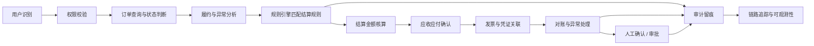
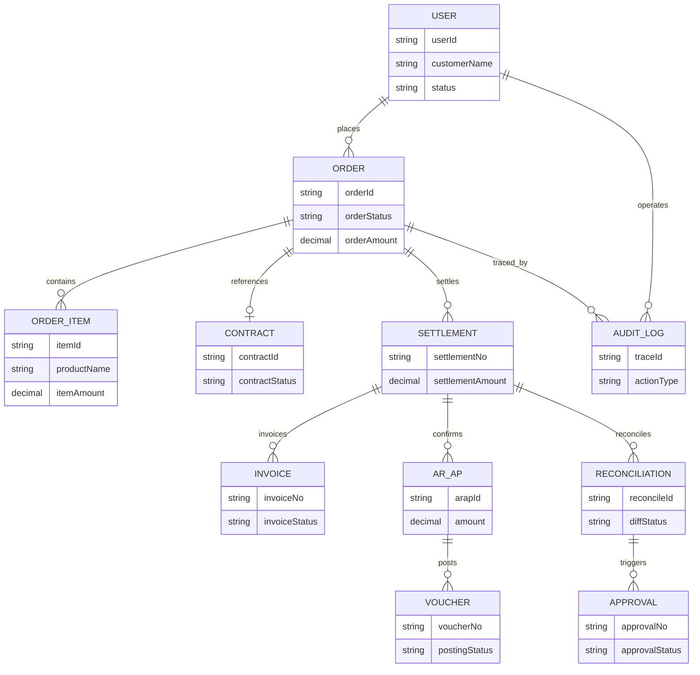
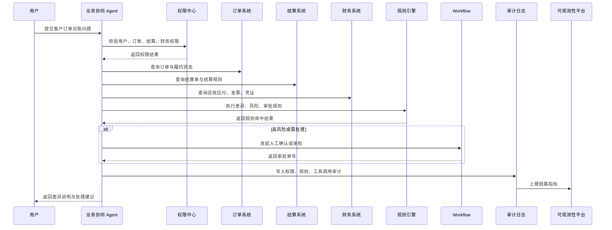

# 用户订单结算财务协同方案

版本：v1.0  
更新时间：2026-06-29  
适用对象：企业软件工程师 / 架构师 / 技术负责人  

## 1. 本章核心结论

用户、订单、结算、财务协同是企业 AI Agent 从单点问答走向端到端业务处理的重要场景。该链路必须以业务系统事实数据、规则引擎确定性判断、权限中心安全控制和 Workflow 人工确认为基础。

大模型负责识别用户意图、归纳跨系统信息、生成说明和辅助分析；金额计算、结算规则、权限判断、订单状态流转、发票凭证关联、审批条件和风险命中不能只依赖大模型。

## 2. 业务背景

企业经常需要处理“某个用户的订单为什么没有结算”“某笔结算金额为什么与订单金额不一致”“某客户应收、发票和凭证是否匹配”等跨系统问题。传统处理方式需要业务、结算、财务、客服和销售在多个系统中查询和对账。

业务协同 Agent 的目标是把用户识别、订单状态、履约异常、结算规则、应收应付、发票凭证和对账差异串联为一条可追溯链路。

## 3. 建设目标

1. 建立用户、订单、结算、财务之间的端到端查询与分析链路。
2. 支持跨系统异常识别、差异归因和处理建议。
3. 明确规则引擎、大模型、业务系统和 Workflow 的职责边界。
4. 对金额、合同、发票、支付、退款、结算和财务入账等高风险动作进行确认或审批。
5. 保证分析结论可追溯、可审计、可复核。

## 4. 典型使用场景

- 查询某用户相关订单的履约、结算和财务状态。
- 分析订单已完成但未结算的原因。
- 分析结算金额与订单金额、合同金额、发票金额不一致的原因。
- 查询客户应收、发票、凭证和付款状态。
- 生成对账差异说明和处理建议。
- 识别用户、订单、结算、财务之间的风险链路。

## 5. 核心能力设计

- 用户识别：确定客户、会员、账号或业务对象。
- 订单分析：查询订单状态、履约节点和异常原因。
- 结算匹配：匹配结算规则、周期、金额和差异。
- 财务确认：查询应收应付、发票、收付款和凭证关联。
- 对账辅助：汇总跨系统差异并生成处理建议。
- 风险控制：识别高风险操作并触发确认或审批。
- 审计追踪：记录端到端链路、数据来源和规则命中。

## 6. 数据来源与系统集成

典型系统包括用户系统、CRM、订单系统、库存或履约系统、合同系统、结算系统、发票系统、资金系统、财务系统、ERP、Workflow 和审计平台。

集成建议：

1. 用户主数据由用户系统或 CRM 提供。
2. 订单状态和履约节点由订单系统和履约系统提供。
3. 结算规则、结算单和结算状态由结算系统提供。
4. 应收应付、发票、收付款和凭证由财务系统或 ERP 提供。
5. 规则引擎负责跨系统匹配、风险命中和审批条件判断。

## 7. Agent 工作流程

端到端链路建议如下：

### 7.1 用户-订单-结算-财务协同链路图

Mermaid 源文件：[用户订单结算财务协同链路图.mmd](../../mermaid/20-业务协同Agent/用户订单结算财务协同链路图.mmd)

1. 用户信息识别：根据客户名称、账号、手机号或业务编号定位用户。
2. 订单查询与状态判断：查询用户相关订单，判断订单状态和履约节点。
3. 订单履约与异常分析：关联库存、物流、合同或服务交付状态，识别异常原因。
4. 结算规则匹配：根据合同、订单类型、账期、计费项和扣减项匹配结算规则。
5. 结算金额核算：由结算系统或规则引擎计算金额、差异和调整项。
6. 财务应收应付确认：查询应收、应付、收付款和账务状态。
7. 发票与凭证关联：关联发票、凭证和财务入账记录。
8. 对账与异常处理：识别跨系统金额、状态或时间差异。
9. 审计留痕：记录数据来源、规则命中、工具调用和分析结论。
10. 人工确认或审批：涉及退款、结算调整、付款、入账等动作时进入确认或审批。

## 8. 规则引擎设计

规则引擎重点处理：

- 用户数据访问范围和隐私脱敏规则。
- 订单状态、履约异常和风险命中规则。
- 结算周期、结算金额和差异识别规则。
- 应收应付、发票、凭证匹配规则。
- 退款、调整、付款、入账等高风险动作审批条件。
- 跨系统数据不一致时的异常等级和处理路由。

大模型只能基于规则结果和系统事实数据进行归纳说明，不能自行裁决金额、状态、权限、发票合规性或财务入账。

## 9. 权限与安全设计

- 用户、订单、结算、财务数据需要分别进行权限判断。
- 跨系统查询时不能因用户拥有订单权限就自动获得财务权限。
- 金额、发票、合同、支付、退款、银行账号、用户隐私字段必须脱敏和分级授权。
- 高风险动作必须经过用户确认、主管审批、财务审批或业务系统原流程。
- 所有关联查询和结果输出都需要记录审计日志。

## 10. 性能与稳定性设计

- 多系统查询应采用并行调用、超时控制和部分结果降级。
- 用户订单、结算明细和财务流水数据量大，需要分页、索引、时间范围和状态过滤。
- 高频查询可以缓存用户摘要、订单状态摘要和结算规则，但关键金额和权限必须实时校验。
- 跨系统对账、批量异常识别和报表生成应使用异步任务与消息队列。
- 退款、结算调整、付款确认等动作必须具备幂等设计。
- 使用 traceId 串联用户、订单、结算、财务、规则引擎和 Workflow 调用。
- 控制模型上下文，仅注入关键摘要、规则结果和差异明细，降低 Token 成本。

## 11. 审计与可观测性

审计日志应记录用户身份、查询对象、订单号、结算单号、发票号、凭证号、数据来源、规则版本、规则命中、工具调用、权限判断、输出结论和人工确认记录。

关键指标包括端到端响应时间、跨系统调用成功率、差异识别准确率、权限拒绝次数、超时降级次数、异步任务成功率、人工确认率和 Token 消耗。

## 12. 企业落地建议

建议先建设只读端到端查询能力，再补充差异识别和处理建议，最后接入退款、结算调整、付款和入账等高风险流程。端到端协同应从少量高价值场景试点，避免一开始覆盖所有业务规则。

## 13. 工程化设计补充

### 13.1 数据字段清单

- 用户字段：用户 ID、客户编号、账号状态、用户类型、归属组织、风险标签。
- 订单字段：订单号、订单状态、订单金额、履约状态、合同号、发票号。
- 结算字段：结算单号、结算周期、应结金额、实结金额、差异金额、规则版本。
- 财务字段：应收单号、应付单号、发票号、凭证号、收付款状态、账龄。
- 链路字段：traceId、任务 ID、数据来源、更新时间、规则命中、人工确认记录。

### 13.2 接口清单

- `user.resolveIdentity`：识别用户或客户。
- `order.queryByUser`：查询用户关联订单。
- `order.queryFulfillment`：查询订单履约状态。
- `settlement.queryByOrder`：查询订单关联结算单。
- `settlement.calculateAmount`：核算或复核结算金额。
- `finance.queryReceivablePayable`：查询应收应付。
- `finance.queryInvoiceVoucher`：查询发票和凭证。
- `workflow.createApproval`：创建高风险处理审批。

### 13.3 规则清单

- 用户访问权限和隐私脱敏规则。
- 订单状态和履约异常规则。
- 订单、合同、结算、发票、凭证匹配规则。
- 结算金额差异识别规则。
- 应收应付账龄和收付款状态规则。
- 退款、调整、付款、入账审批触发规则。

### 13.4 权限矩阵

| 角色 | 用户信息 | 订单信息 | 结算信息 | 财务信息 | 高风险处理 |
| --- | --- | --- | --- | --- | --- |
| 客服 | 脱敏 | 授权订单 | 只读摘要 | 禁止 | 发起申请 |
| 销售 | 归属客户 | 归属订单 | 受限 | 受限 | 发起申请 |
| 结算专员 | 授权范围 | 授权范围 | 允许 | 受限 | 需审批 |
| 财务人员 | 授权范围 | 授权范围 | 允许 | 允许 | 需审批 |
| 管理员 | 授权范围内全部 | 授权范围内全部 | 允许 | 允许 | 需审批 |

### 13.5 异常场景

- 用户识别存在多个候选对象。
- 订单已完成但未生成结算单。
- 结算金额与订单、合同或发票金额不一致。
- 发票已开但财务未入账。
- 应收超期或付款状态异常。
- 任一关联系统超时或数据版本不一致。

### 13.6 审批与人工确认节点

- 用户对象存在歧义时需要人工选择。
- 涉及退款、结算调整、付款确认、入账处理必须进入审批。
- 对账异常关闭、差异原因确认和调整建议采纳需要业务或财务复核。

### 13.7 审计字段

记录用户 ID、订单号、结算单号、发票号、凭证号、查询人、权限判断、规则命中、数据来源、异常分类、处理建议、确认动作、审批单号和 traceId。

### 13.8 性能指标

- 端到端查询 P95。
- 单系统接口成功率。
- 跨系统聚合耗时。
- 差异识别任务耗时。
- 异步任务成功率。
- 降级返回比例。
- Token 平均消耗。

### 13.9 缓存策略

- 用户摘要、订单状态摘要、结算规则、字段字典可缓存。
- 金额、权限、发票状态、收付款状态和凭证状态在最终结论前必须实时校验。
- 端到端分析结果可按任务缓存，绑定数据版本和有效期。

### 13.10 降级策略

- 用户系统不可用时停止端到端分析并提示无法识别主体。
- 订单系统不可用时返回用户摘要，不生成结算或财务判断。
- 结算系统不可用时不生成金额差异结论。
- 财务系统不可用时不生成应收应付和入账结论。
- 模型不可用时返回结构化链路数据和规则命中结果。

## 14. v1.1 样板深化初稿

以下内容为样板示例，需结合企业实际系统、字段口径、接口规范、权限体系和业务规则确认。

### 14.1 端到端业务样板场景

样板场景：客户订单结算与财务对账异常处理。

端到端链路：

1. 用户识别：根据客户编号、会员账号或客户名称定位业务对象。
2. 权限校验：校验当前操作人是否可查看该用户、订单、结算和财务信息。
3. 订单查询：查询订单基础信息、订单金额、订单状态和关联合同。
4. 履约状态判断：由订单系统或履约系统判断是否已完成交付。
5. 结算规则匹配：由规则引擎根据合同、订单类型、账期和计费项匹配结算规则。
6. 结算金额核算：由结算系统或规则引擎计算应结金额、调整金额和差异金额。
7. 应收应付确认：由财务系统确认应收、应付、收付款和账龄状态。
8. 发票与凭证关联：查询发票状态、凭证状态和入账状态。
9. 对账差异识别：识别订单、结算、发票、收付款和凭证之间的差异。
10. 异常原因归纳：大模型基于授权数据、规则命中和系统返回结果生成摘要。
11. 人工确认或审批：涉及退款、调账、结算调整、付款或入账时进入审批。
12. 审计留痕：记录权限判断、规则命中、工具调用、模型输出和人工确认。
13. 结果反馈：向用户返回差异结论、处理建议、审批状态和引用来源。

### 14.2 字段清单

| 字段名 | 字段中文名 | 来源系统 | 字段说明 | 是否敏感 | 是否需要脱敏 | 权限要求 | 是否可由 Agent 展示 | 备注 |
| --- | --- | --- | --- | --- | --- | --- | --- | --- |
| customerId | 用户编号 | 用户系统 | 客户、会员或业务对象唯一标识 | 是 | 是 | 用户数据权限 | 是，脱敏 | 示例 |
| customerStatus | 用户状态 | 用户系统 | 正常、冻结、注销、黑名单等 | 是 | 否 | 用户查看权限 | 是 | 示例 |
| orderNo | 订单号 | 订单系统 | 订单唯一编号 | 否 | 否 | 订单查看权限 | 是 | 示例 |
| orderAmount | 订单金额 | 订单系统 | 订单含税或不含税金额 | 是 | 视角色 | 金额查看权限 | 受限 | 示例 |
| fulfillmentStatus | 履约状态 | 履约系统 | 出库、发货、签收、交付完成等 | 否 | 否 | 订单履约权限 | 是 | 示例 |
| settlementNo | 结算单号 | 结算系统 | 结算单唯一编号 | 否 | 否 | 结算查看权限 | 是 | 示例 |
| settlementAmount | 结算金额 | 结算系统 | 应结、已结或差异金额 | 是 | 视角色 | 结算金额权限 | 受限 | 示例 |
| receivableAmount | 应收金额 | 财务系统 | 对客户应收金额 | 是 | 视角色 | 财务权限 | 受限 | 示例 |
| invoiceNo | 发票号码 | 发票系统 | 关联发票编号 | 是 | 是 | 发票查看权限 | 受限 | 示例 |
| voucherNo | 凭证号码 | 财务系统 | 财务凭证编号 | 是 | 是 | 凭证查看权限 | 受限 | 示例 |
| traceId | 链路追踪ID | 审计平台 | 端到端调用链路标识 | 否 | 否 | 审计权限 | 否 | 示例 |

### 14.3 接口清单

| 接口名称 | 接口用途 | 所属系统 | 调用方式 | 入参摘要 | 出参摘要 | 权限要求 | 是否高风险 | 失败处理 | 备注 |
| --- | --- | --- | --- | --- | --- | --- | --- | --- | --- |
| user.queryProfile | 用户信息查询接口 | 用户系统 | API/MCP | customerId/name | 用户摘要、状态 | 用户查看权限 | 否 | 返回无法识别主体 | 示例 |
| order.queryDetail | 订单查询接口 | 订单系统 | API/MCP | orderNo/customerId | 订单详情 | 订单查看权限 | 否 | 返回部分链路不可用 | 示例 |
| order.queryFulfillment | 订单履约状态查询接口 | 履约系统 | API/MCP | orderNo | 履约节点 | 履约查看权限 | 否 | 标记履约未知 | 示例 |
| settlement.queryBill | 结算单查询接口 | 结算系统 | API/MCP | orderNo/customerId | 结算单摘要 | 结算查看权限 | 否 | 返回待补查 | 示例 |
| settlement.queryRule | 结算规则查询接口 | 结算系统/规则引擎 | API | ruleKey/orderType | 规则版本、口径 | 规则查看权限 | 否 | 禁止金额裁决 | 示例 |
| finance.queryARAP | 应收应付查询接口 | 财务系统 | API/MCP | customerId/orderNo | 应收应付摘要 | 财务查看权限 | 是 | 不输出财务结论 | 示例 |
| invoice.query | 发票查询接口 | 发票系统 | API/MCP | invoiceNo/orderNo | 发票状态 | 发票权限 | 是 | 标记发票未知 | 示例 |
| voucher.query | 凭证查询接口 | 财务系统 | API/MCP | voucherNo/orderNo | 凭证状态 | 凭证权限 | 是 | 标记凭证未知 | 示例 |
| reconcile.queryResult | 对账结果查询接口 | 对账系统 | API | taskId/orderNo | 差异结果 | 对账权限 | 是 | 转异步任务 | 示例 |
| workflow.createApproval | 审批流发起接口 | Workflow | API | actionType/resourceId | 审批单号 | 发起审批权限 | 是 | 提示人工处理 | 示例 |
| audit.writeLog | 审计日志写入接口 | 审计平台 | API/消息 | traceId/action | 审计结果 | 系统权限 | 否 | 本地缓冲重试 | 示例 |

### 14.4 规则清单

| 规则编号 | 规则名称 | 适用环节 | 规则说明 | 规则来源 | 执行主体 | 命中后动作 | 是否需要人工确认 | 审计要求 | 备注 |
| --- | --- | --- | --- | --- | --- | --- | --- | --- | --- |
| BIZ-COLLAB-RULE-001 | 用户状态校验 | 用户识别 | 冻结、注销、黑名单用户限制继续处理 | 用户系统 | 规则引擎 | 阻断或转人工 | 是 | 记录状态和原因 | 示例 |
| BIZ-COLLAB-RULE-002 | 订单状态校验 | 订单查询 | 订单取消、关闭、退货中不得直接结算 | 订单系统 | 规则引擎 | 阻断结算判断 | 是 | 记录订单状态 | 示例 |
| BIZ-COLLAB-RULE-003 | 履约完成校验 | 履约判断 | 未完成履约不得确认结算 | 履约系统 | 规则引擎 | 标记待履约 | 否 | 记录履约节点 | 示例 |
| BIZ-COLLAB-RULE-004 | 结算周期校验 | 结算匹配 | 当前订单是否落入可结算周期 | 结算系统 | 规则引擎 | 进入或延后结算 | 否 | 记录周期 | 示例 |
| BIZ-COLLAB-RULE-005 | 结算金额差异校验 | 金额核算 | 结算金额与订单、合同差异超阈值 | 结算系统 | 规则引擎 | 触发差异分析 | 是 | 记录差异金额 | 示例 |
| BIZ-COLLAB-RULE-006 | 发票状态校验 | 发票关联 | 发票缺失、作废或红冲时阻断入账结论 | 发票系统 | 规则引擎 | 标记异常 | 是 | 记录发票状态 | 示例 |
| BIZ-COLLAB-RULE-007 | 凭证状态校验 | 凭证关联 | 未生成或已冲销凭证需财务复核 | 财务系统 | 规则引擎 | 转财务复核 | 是 | 记录凭证状态 | 示例 |
| BIZ-COLLAB-RULE-008 | 对账差异阈值校验 | 对账差异 | 差异金额或比例超过阈值 | 对账系统 | 规则引擎 | 发起审批 | 是 | 记录阈值和命中 | 示例 |
| BIZ-COLLAB-RULE-009 | 高风险操作审批校验 | 异常处理 | 退款、调整、付款、入账需审批 | Workflow | 规则引擎 | 创建审批 | 是 | 记录审批单 | 示例 |

### 14.5 权限矩阵

| 角色 | 查看用户信息 | 查看订单信息 | 查看结算单 | 查看应收应付 | 查看发票信息 | 查看财务凭证 | 发起对账分析 | 发起异常处理 | 发起审批 | 导出数据 | 查看审计日志 |
| --- | --- | --- | --- | --- | --- | --- | --- | --- | --- | --- | --- |
| 业务运营人员 | 脱敏 | 允许 | 受限 | 禁止 | 禁止 | 禁止 | 允许 | 申请 | 申请 | 受限 | 禁止 |
| 客服人员 | 脱敏 | 允许 | 摘要 | 禁止 | 禁止 | 禁止 | 申请 | 申请 | 申请 | 禁止 | 禁止 |
| 财务人员 | 授权 | 授权 | 允许 | 允许 | 允许 | 允许 | 允许 | 允许 | 允许 | 受限 | 受限 |
| 结算人员 | 授权 | 授权 | 允许 | 受限 | 受限 | 禁止 | 允许 | 允许 | 允许 | 受限 | 受限 |
| 部门负责人 | 授权范围 | 授权范围 | 受限 | 受限 | 受限 | 禁止 | 允许 | 允许 | 允许 | 受限 | 禁止 |
| 审计人员 | 只读 | 只读 | 只读 | 只读 | 只读 | 只读 | 只读 | 禁止 | 禁止 | 受限 | 允许 |
| 系统管理员 | 配置权限 | 配置权限 | 配置权限 | 禁止业务数据 | 禁止业务数据 | 禁止业务数据 | 配置 | 禁止 | 禁止 | 禁止 | 配置审计 |

### 14.6 异常场景

| 异常编号 | 异常名称 | 触发条件 | Agent 响应方式 | 是否降级 | 是否需要人工处理 | 审计要求 |
| --- | --- | --- | --- | --- | --- | --- |
| BIZ-EX-001 | 用户不存在 | 用户系统无匹配主体 | 返回候选为空并要求核对 | 是 | 是 | 记录输入摘要 |
| BIZ-EX-002 | 用户状态异常 | 冻结、注销、黑名单 | 停止后续高风险分析 | 是 | 是 | 记录状态命中 |
| BIZ-EX-003 | 订单不存在 | 订单系统无记录 | 返回未找到并建议核对订单号 | 是 | 是 | 记录订单号 |
| BIZ-EX-004 | 订单状态不允许结算 | 订单取消、关闭、退货中 | 返回规则命中和不可结算原因 | 否 | 视情况 | 记录规则编号 |
| BIZ-EX-005 | 结算规则缺失 | 无可用规则版本 | 不生成结算结论 | 是 | 是 | 记录规则键 |
| BIZ-EX-006 | 结算金额不一致 | 差异超阈值 | 生成差异说明并建议审批 | 否 | 是 | 记录差异 |
| BIZ-EX-007 | 发票信息缺失 | 未找到发票或状态未知 | 标记发票待补充 | 是 | 是 | 记录发票查询 |
| BIZ-EX-008 | 凭证未生成 | 财务系统无凭证 | 不生成入账完成结论 | 是 | 是 | 记录凭证状态 |
| BIZ-EX-009 | 对账差异超阈值 | 差异规则命中 | 触发异常处理建议 | 否 | 是 | 记录阈值 |
| BIZ-EX-010 | 权限不足 | 权限中心拒绝 | 返回无权限提示 | 是 | 否 | 记录拒绝原因 |
| BIZ-EX-011 | 接口超时 | 下游接口超时 | 返回部分结果并提示稍后重试 | 是 | 视情况 | 记录超时系统 |
| BIZ-EX-012 | 下游系统不可用 | 系统熔断或故障 | 降级为只读已缓存信息 | 是 | 是 | 记录降级策略 |

### 14.7 测试用例

| 测试编号 | 测试场景 | 输入条件 | 预期结果 | 涉及系统 | 涉及规则 | 是否高风险 | 验收要点 |
| --- | --- | --- | --- | --- | --- | --- | --- |
| BIZ-TC-001 | 正常端到端查询 | 正常用户、已履约订单 | 返回完整链路摘要 | 用户/订单/结算/财务 | 001-007 | 否 | 来源和规则清晰 |
| BIZ-TC-002 | 用户状态异常 | 冻结用户 | 阻断高风险处理 | 用户系统 | 001 | 是 | 有审计 |
| BIZ-TC-003 | 订单不可结算 | 订单已取消 | 返回不可结算原因 | 订单系统 | 002 | 否 | 不调用财务裁决 |
| BIZ-TC-004 | 结算规则缺失 | 无规则版本 | 不生成金额结论 | 结算系统 | 004 | 是 | 提示人工维护 |
| BIZ-TC-005 | 金额差异超阈值 | 差异金额超限 | 触发异常说明和审批建议 | 结算/财务 | 005/008 | 是 | 审批入口明确 |
| BIZ-TC-006 | 发票缺失 | 无发票记录 | 标记发票待补充 | 发票系统 | 006 | 否 | 不生成入账完成 |
| BIZ-TC-007 | 权限不足 | 客服查凭证 | 拒绝并脱敏 | 权限中心 | 权限策略 | 是 | 无敏感泄露 |
| BIZ-TC-008 | 下游超时 | 财务系统超时 | 返回部分结果并记录降级 | 财务系统 | 降级策略 | 否 | traceId 完整 |

### 14.8 待确认事项

- 字段口径、接口名称、规则编号、权限矩阵均为示例，需结合企业实际系统确认。
- 金额差异阈值、账期、审批条件和脱敏策略需由业务、财务、法务和安全团队共同确认。
- 高风险动作上线前需完成测试用例、审批流、审计日志和回滚方案评审。

## 15. 图示补充

### 15.1 用户订单结算财务领域对象模型图

Mermaid 源文件：[用户订单结算财务领域对象模型图.mmd](../../mermaid/20-业务协同Agent/用户订单结算财务领域对象模型图.mmd)

### 15.2 客户订单结算与财务对账异常处理时序图

Mermaid 源文件：[客户订单结算与财务对账异常处理时序图.mmd](../../mermaid/20-业务协同Agent/客户订单结算与财务对账异常处理时序图.mmd)

## 16. 后续待完善事项

1. 补充用户-订单-结算-财务领域对象模型。
2. 补充端到端流程图和时序图。
3. 补充跨系统对账规则清单。
4. 补充高风险动作审批矩阵。
5. 补充端到端审计日志字段规范。
